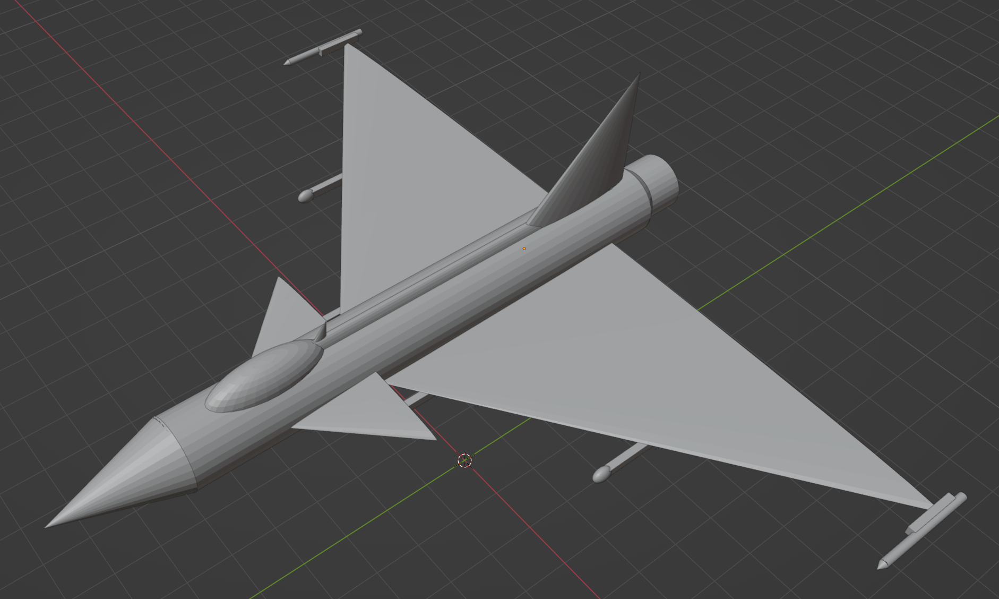
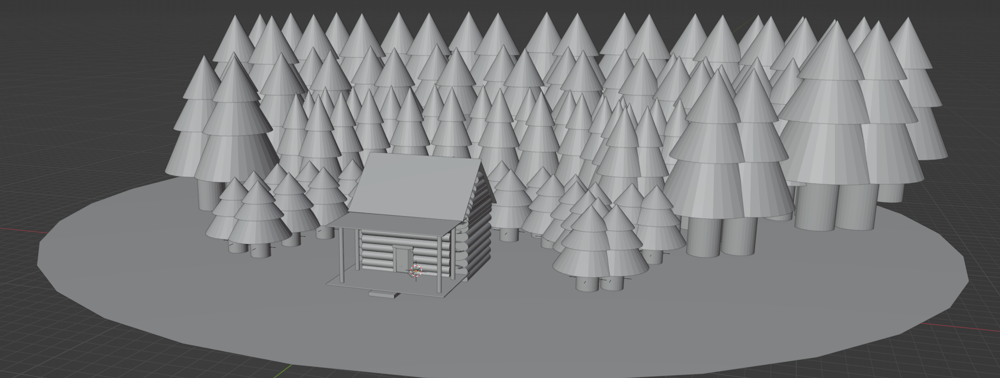
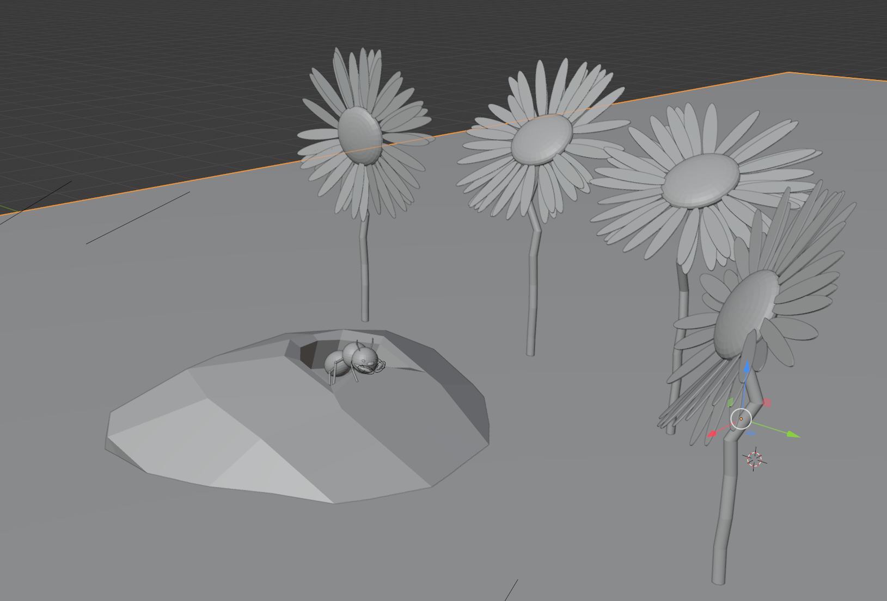
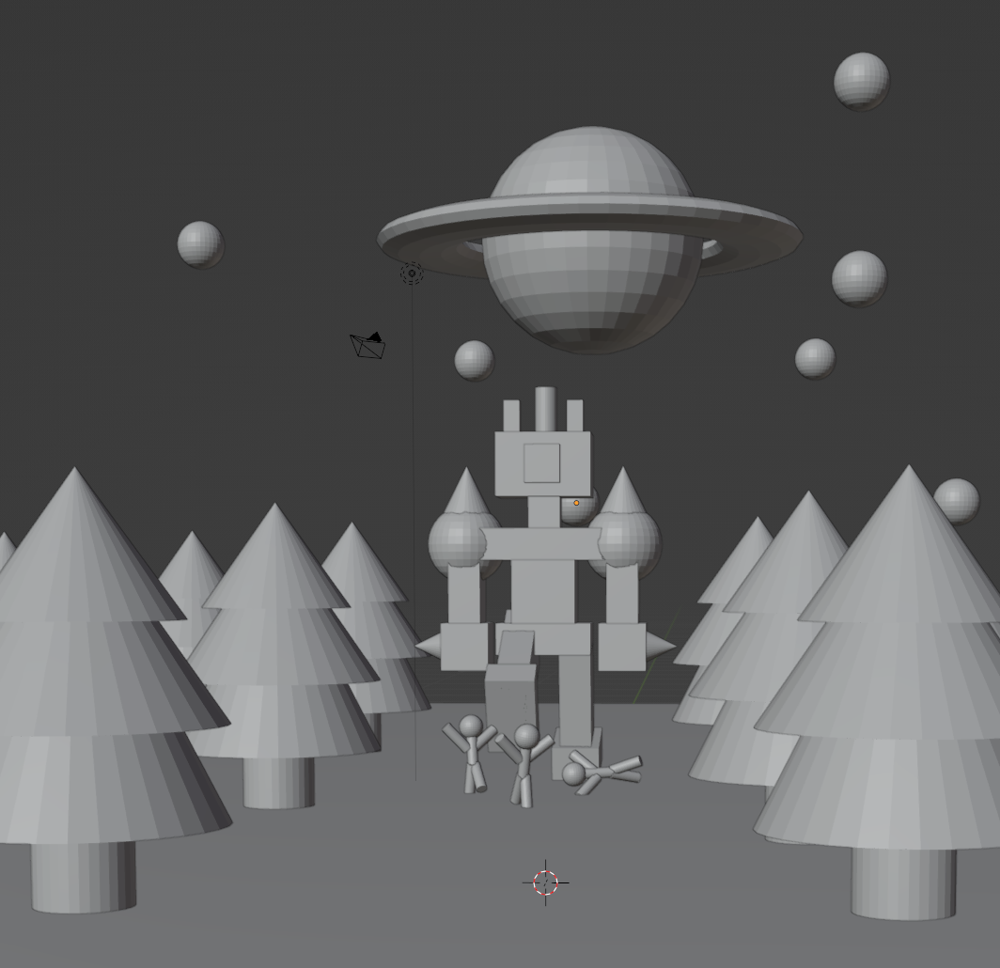
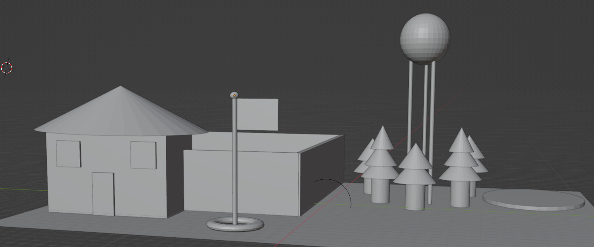

.. _Assignment_02:

Assignment 2 - Primitive Modeling
=================================

.. figure:: 1.png
   :width: 100%

   Model by Taylor Brommel, 2021

* Name your file ``primitive_modeling.blend``. (Your file system might hide the ``.blend`` and only show you the title.
  Blender might create backup files with names ending in ``.blend1``. These are **not** the files you want to upload
  as they typically hold a previous version of your work.)
* Complete the
  `Primitive Modeling Exercise <https://cgcookie.com/lesson/primitive-modeling-exercise>`_.
  Use primitives, the ability to move them and scale the objects to create something of
  your own design.
* Upload the resulting Blender file here.
* In the comments, please state if it is ok to show your work here,
  and if it is ok, how you'd like to be attributed.

.. tip::

  If you are looking for more than a "C", make sure to spend time adding detail
  to your model. Also, use a variety of primitives. (Not just cubes, or spheres.)

.. warning::

   Blender does not auto-save. Save often. Keep backups in case your file corrupts,
   or the computer you are working on crashes.

.. figure:: 2.png
   :width: 100%

   Model by a CIS 160 student, 2021

.. figure:: 3.png
   :width: 100%

   Model by a CIS 160 student, 2021

.. figure:: 4.png
   :width: 100%

   Model by a CIS 160 student, 2021

.. figure:: 5.png
   :width: 100%

   Model by a CIS 160 student, 2021

.. figure:: 6.png
   :width: 100%

   Model by Kole Hicok, 2021

.. figure:: 7.png
   :width: 100%

   Model by Jeffery Roberts, 2021

.. figure:: 8.png
   :width: 100%

   Model by a CIS 160 student, 2021

.. figure:: 9.png
   :width: 100%

   Model by a CIS 160 student, 2021

.. figure:: 10.png
   :width: 100%

   Model by a CIS 160 student, 2021

.. figure:: 11.png
   :width: 100%

   Model by a CIS 160 student, 2021

.. figure:: 12.png
   :width: 100%

   Model by a CIS 160 student, 2021

.. figure:: 13.png
   :width: 100%

   Model by a CIS 160 student, 2021

   Model by a CIS 160 student, 2022

   Model by Jude, 2022

   Model by a CIS 160 student, 2022

   Model by Ean Warrick, 2022

   Model by a CIS 160 student, 2022

.. figure:: 20 .png
   :width: 100%

   Model by a CIS 160 student, 2022

