.. _Assignment_02:

Assignment 2 - Primitive Modeling
=================================

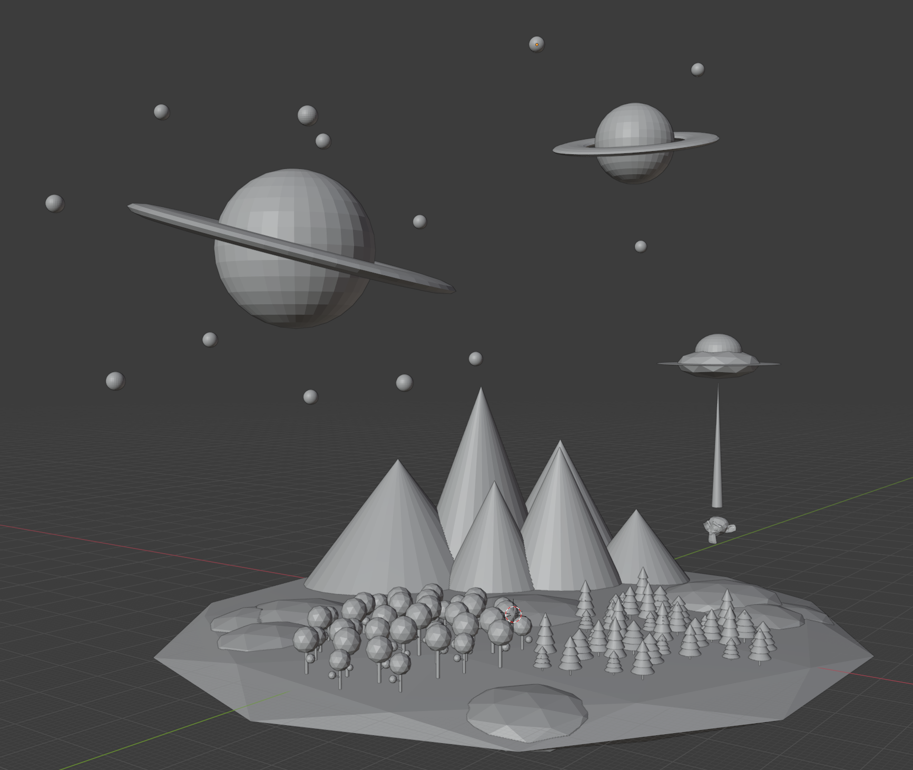

   Model by Taylor Brommel, 2021

* Name your file ``primitive_modeling.blend``
* Complete the
  `Primitive Modeling Exercise <https://cgcookie.com/lesson/primitive-modeling-exercise>`_.
  Use primitives, the ability to move them and scale the objects to create something of
  your own design.
* Upload the resulting Blender file here.

.. tip::

  If you are looking for more than a "C", make sure to spend time adding detail
  to your model.

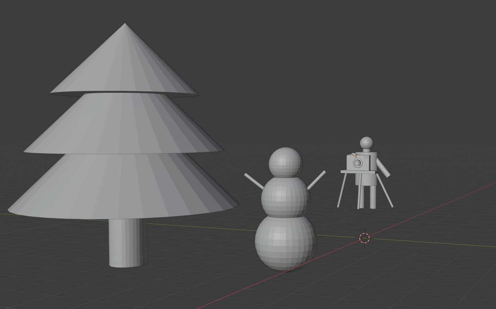

   Model by a CIS 160 student, 2021

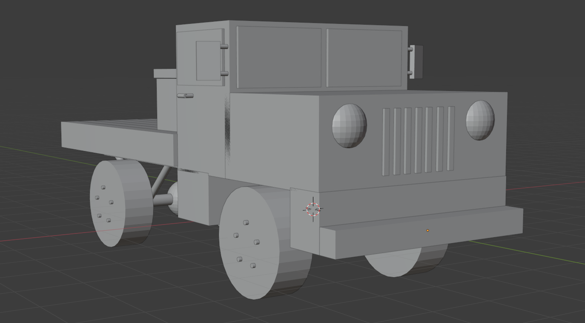

   Model by a CIS 160 student, 2021

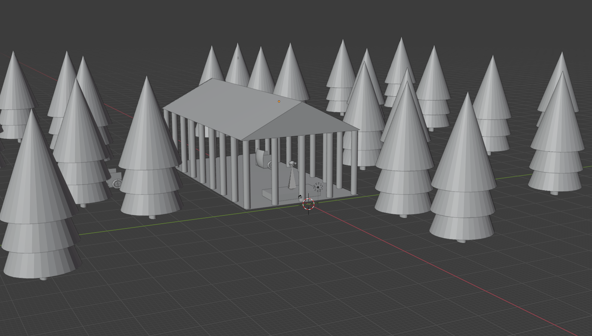

   Model by a CIS 160 student, 2021

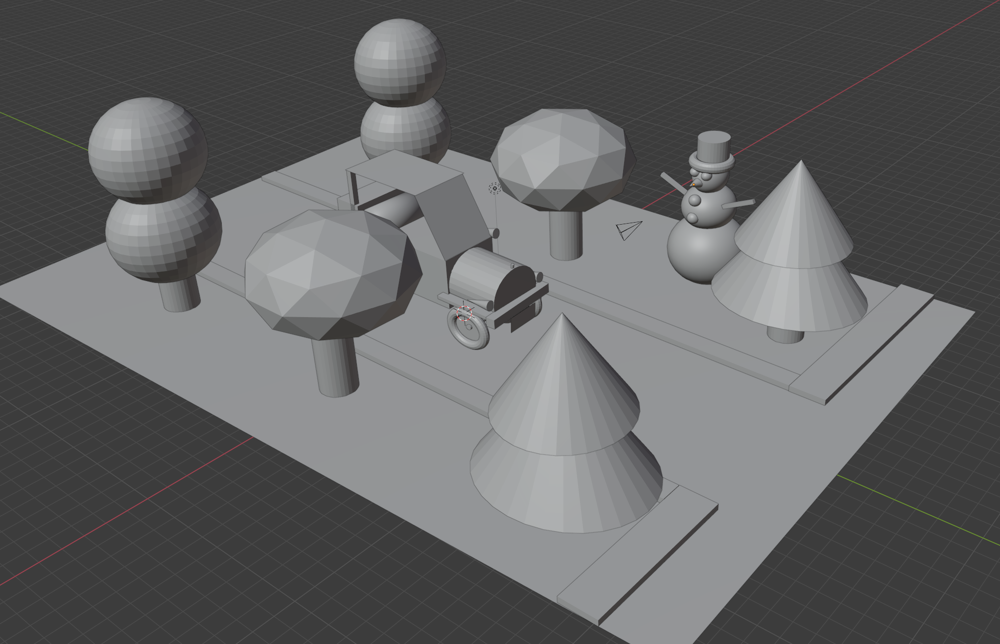

   Model by a CIS 160 student, 2021

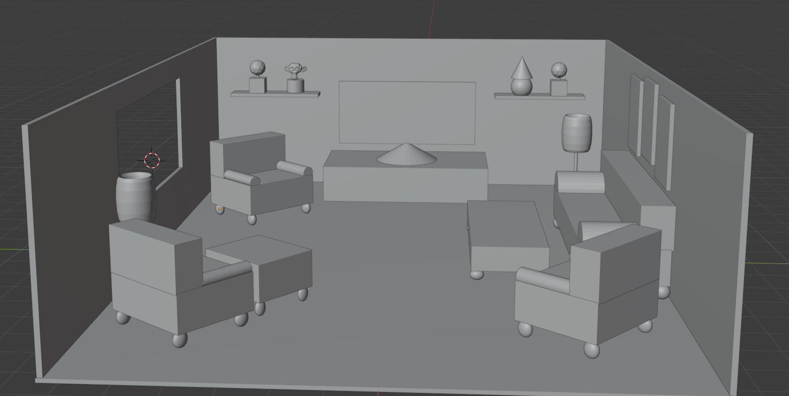

   Model by Kole Hicok, 2021

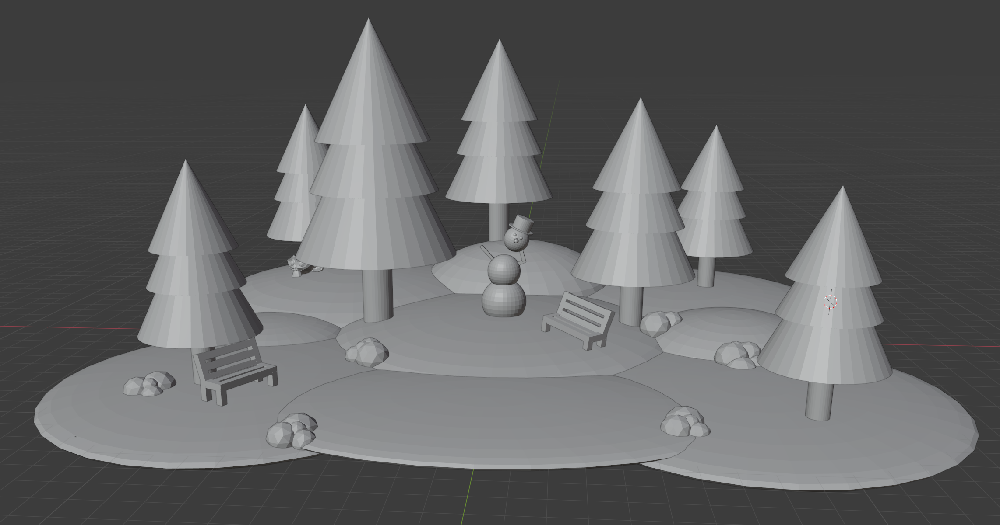

   Model by Jeffery Roberts, 2021

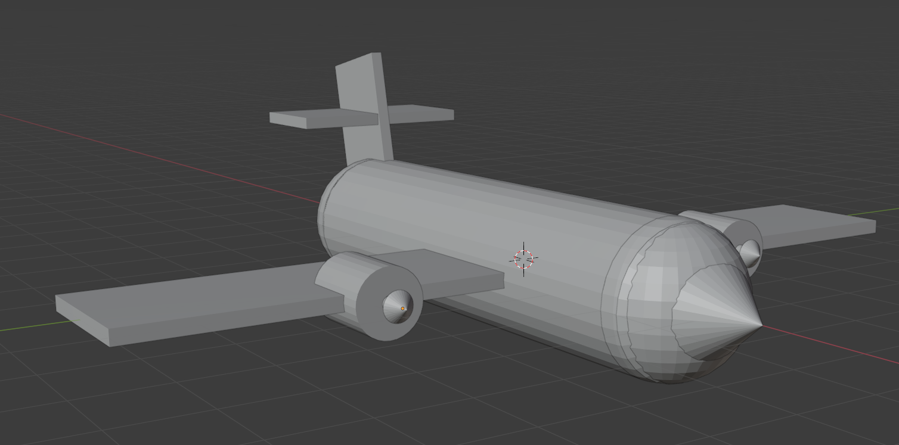

   Model by a CIS 160 student, 2021

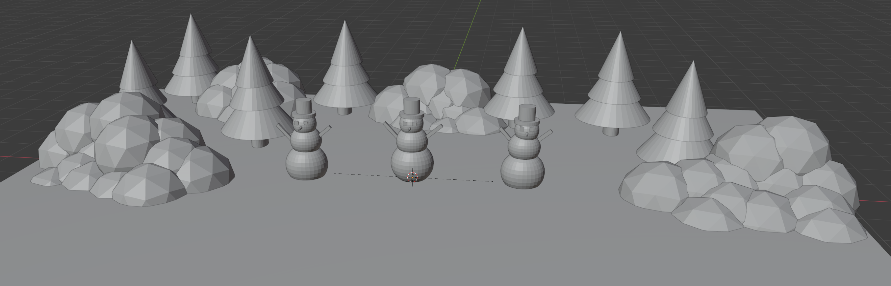

   Model by a CIS 160 student, 2021

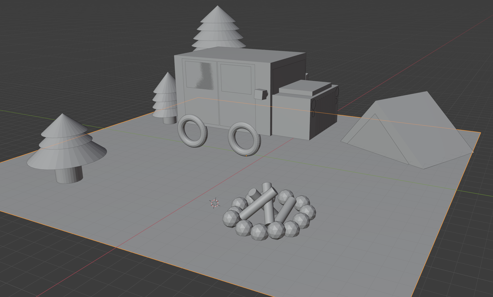

   Model by a CIS 160 student, 2021

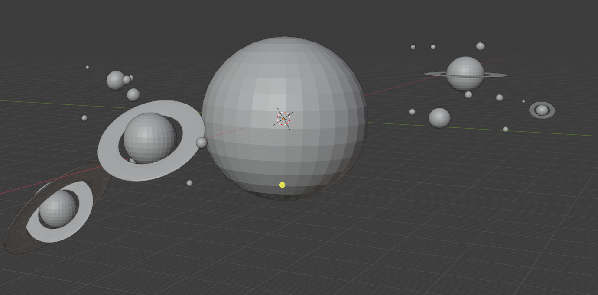

   Model by a CIS 160 student, 2021

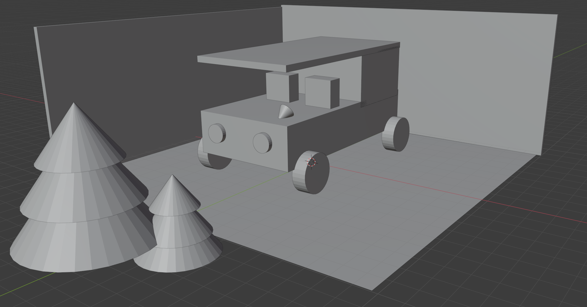

   Model by a CIS 160 student, 2021

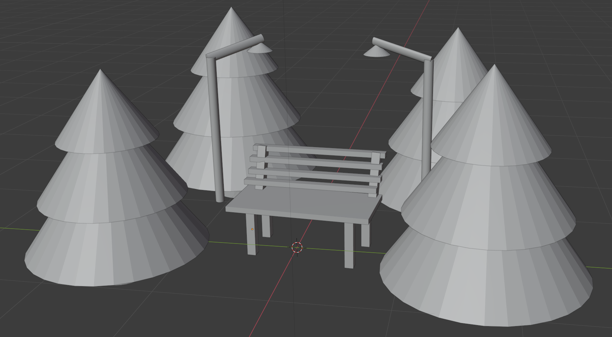

   Model by a CIS 160 student, 2021
