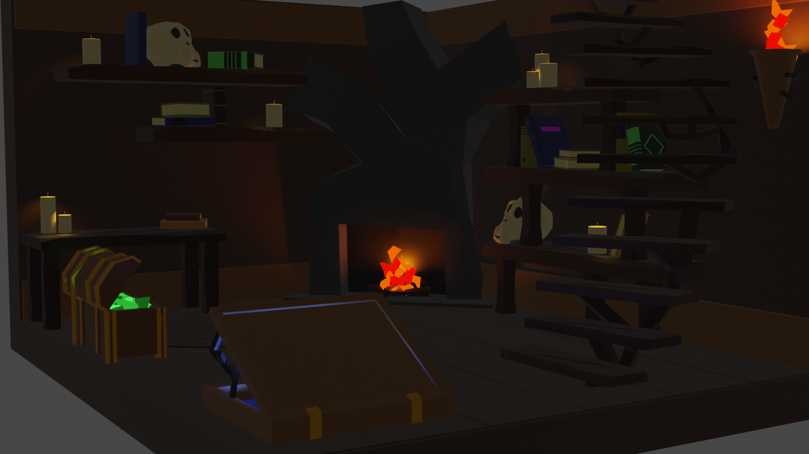
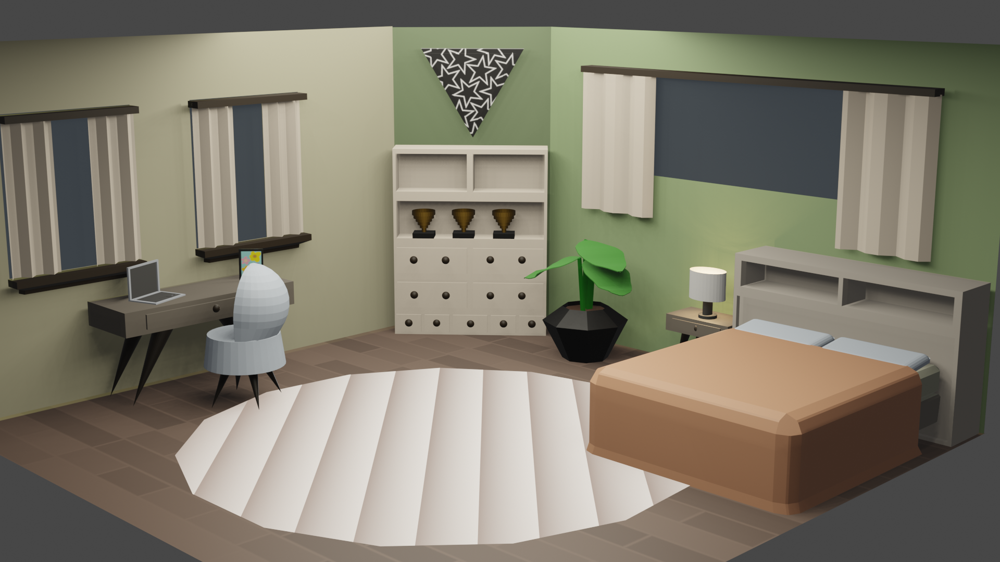
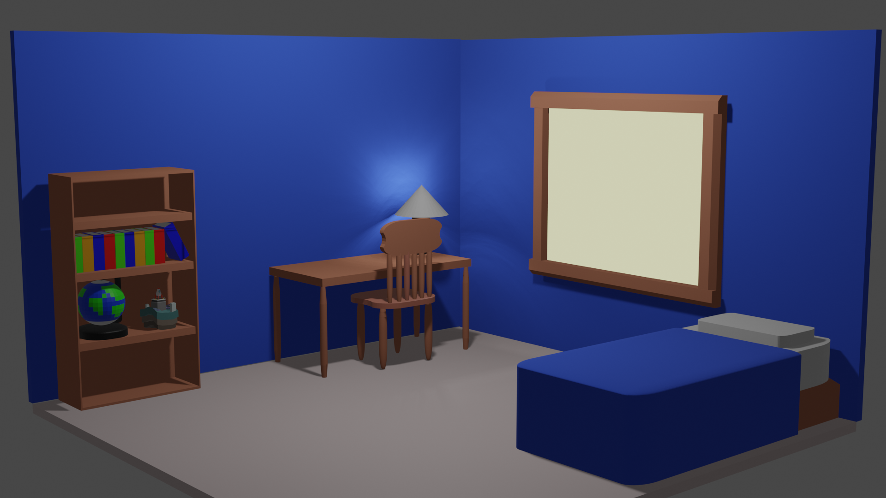
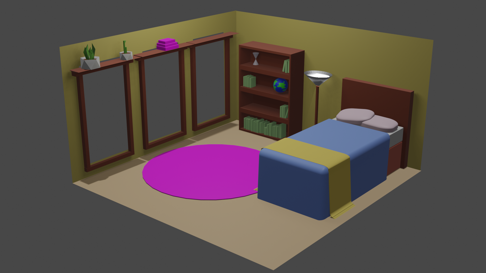
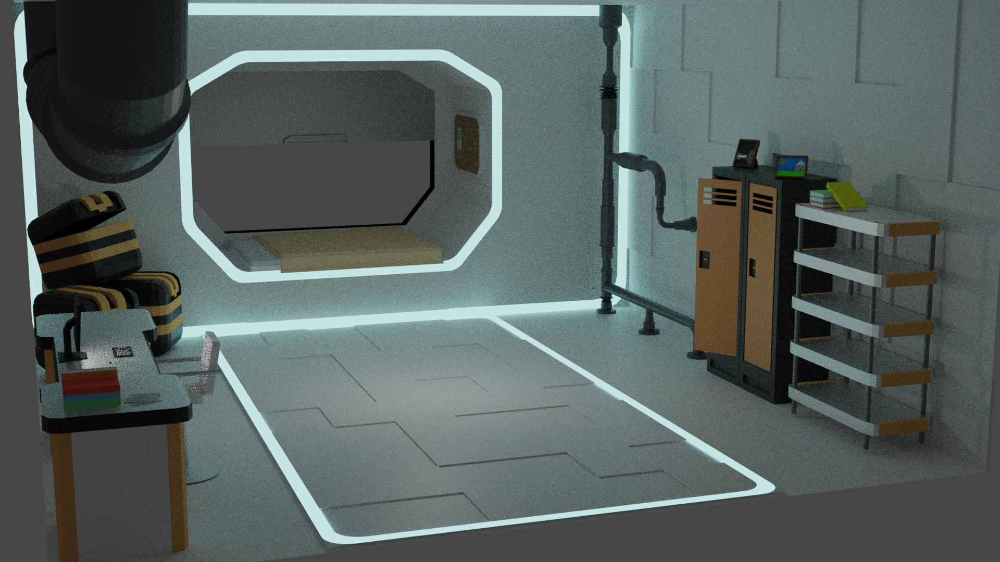
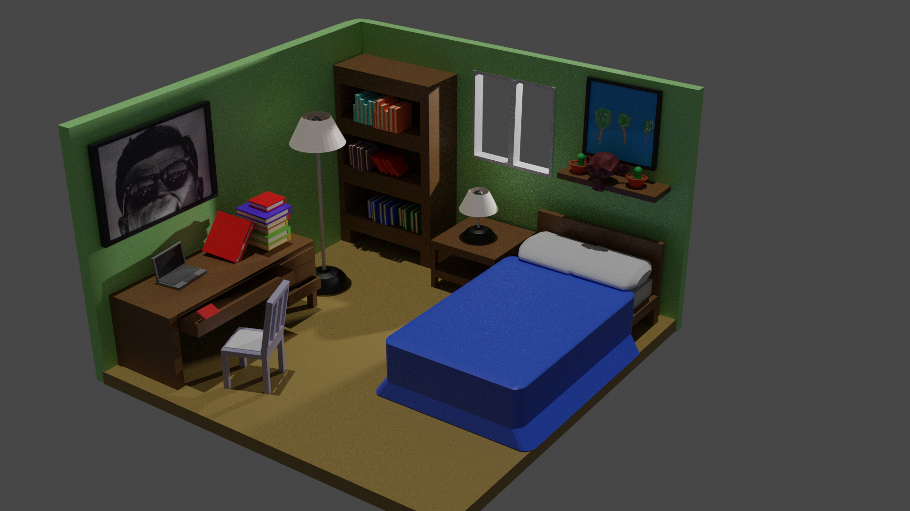
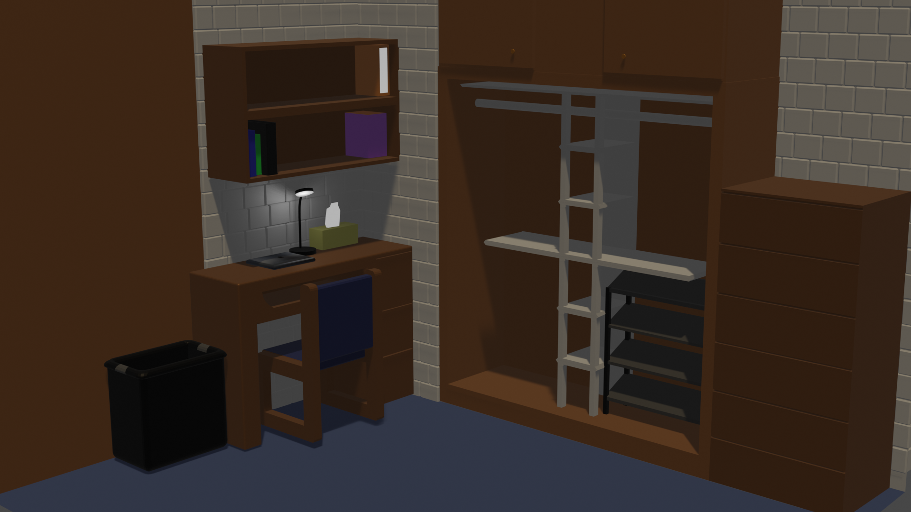
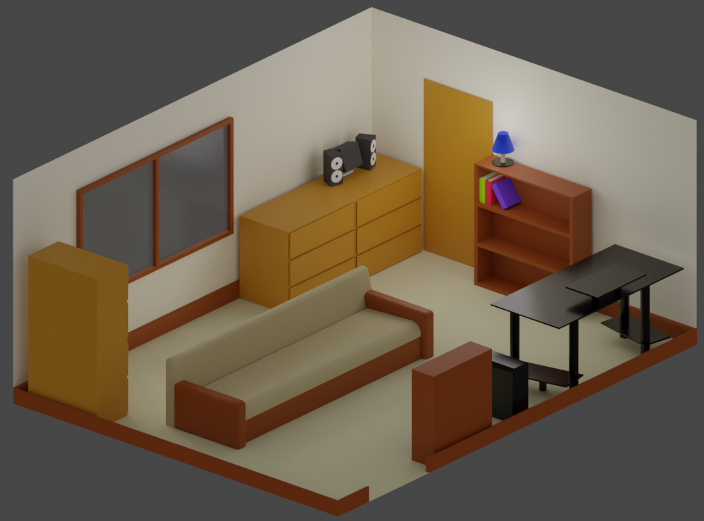
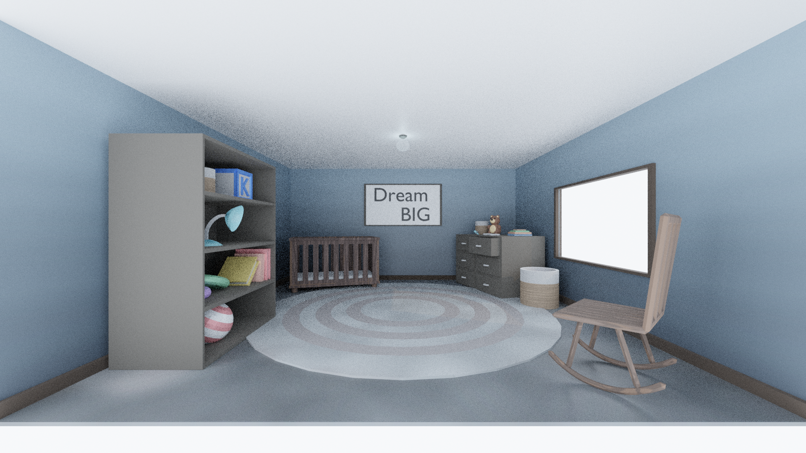

.. _Assignment_05:

Assignment 5 - Low Poly Bedroom
===============================

For this assignment:

* Practice mesh modeling skills by creating a low-poly bedroom
* Practice lighting skills by lighting the bedroom
* Practice your material skills by assigning materials to the items in the bedroom
* Practice UV skills by unwrapping and painting something

Upload your resulting blend file here. Upload the main blend file, not something
that ends in ``.blend1``.

.. figure:: 1.png

    Model by Abby Bowers, 2021

    Model by CIS 160 student, 2021

    Model by CIS 160 student, 2021

    Model by CIS 160 student, 2021

    Model by CIS 160 student, 2021

    Model by Jeffery Roberts, 2021

    Model by CIS 160 student, 2021

.. figure:: 8.png

    Model by CIS 160 student, 2021

.. figure:: 9.png

    Model by CIS 160 student, 2021

    Model by CIS 160 student, 2021

    Model by CIS 160 student, 2021

    Model by Taylor Brommel, 2021
