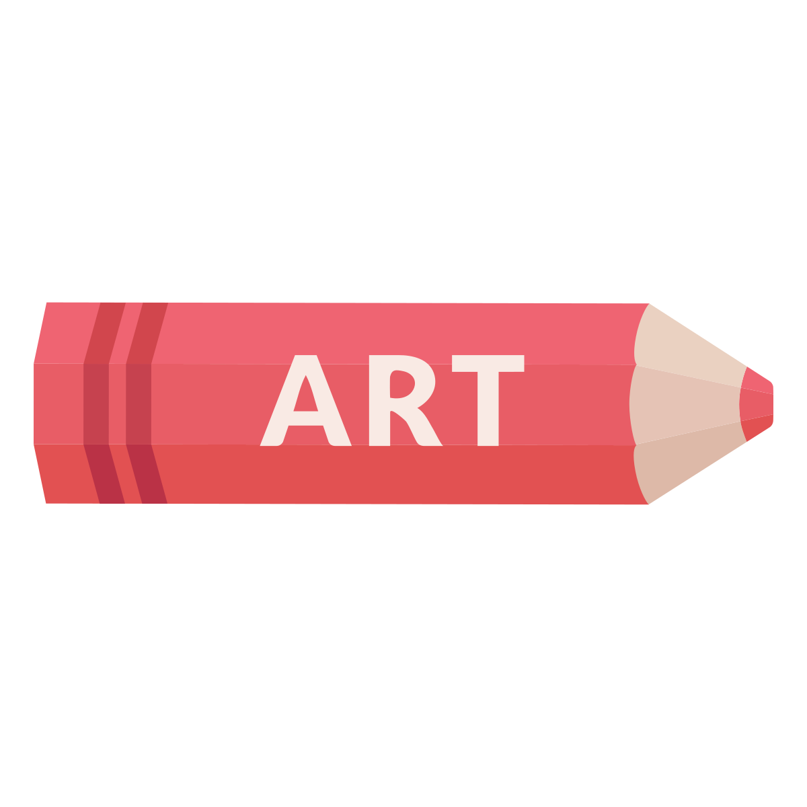

.. _Final_Project:

Final Project
=============

It is time to put everything you've learned to use! Time for the final project.

2021 Projects:

.. raw:: html

    <iframe width="560" height="315" src="https://www.youtube.com/embed/sCeKjr2BY7Y" title="YouTube video player" frameborder="0" allow="accelerometer; autoplay; clipboard-write; encrypted-media; gyroscope; picture-in-picture" allowfullscreen></iframe>

2014 Projects:

.. raw:: html

    <iframe width="560" height="315" src="https://www.youtube.com/embed/_olEMqdFRvA?list=PLUjR0nhln8uYyeKiqWZVjeChDkW1aYMYd" frameborder="0" allowfullscreen></iframe>

The goal of this final project is to:

* Create a 3D image, images, or movie with some kind of artistic theme to show
  of your artistic, technical, and detail skills.
* Reflect on the artistic process.

Directions
----------

* You must fill out 1.) rubric sheet, 2.) reflection, 3.) Blender files (packed), and 4.) rendered images/movie
  and upload to get a final project score.
  Failure to do so will result in no score and failure from the class.
  Be **very** sure you have everything uploaded.
* Replace the orange colored text in the rubric with the information requested.
  If you aren't
  sure about having it filled out correctly, please ask! That will be better
  than failing the class.
* All team members will get the same score. If aren't certain your team member
  will hold up his/her end of the assignment, then don't partner up. Teams may
  not be any larger than three people. Note how the scoring works, I expect
  more from larger teams.
* If a team member fails to make a reasonable contribution to the project,
  the instructor reserves the right to give that team member a zero.

Checklist for turning in work
^^^^^^^^^^^^^^^^^^^^^^^^^^^^^

1.  Elect one person, and only one person, in your group to upload all the files.
2.  "Pack" all Blender files by selecting
    File...External Data...Automatically Pack Into Blend.
3.  Upload all required ``.blend`` files. Do not upload ``.blend1`` files. Those
    are not the files you are looking for. If it is too large, create a Word
    or PDF with a OneDrive link for download.
4.  Upload all rendered images or movies. Again, if too large use OneDrive.
5.  Upload rubric spreadsheet
    :download:`CIS_Final_Project_Template.xlsx<CIS_Final_Project_Template.xlsx>`.
    Be specific with the artistic message. See :ref:`artistic_expression`
    for what is and is not a message.
6.  Spell check the spreadsheet before turning it in. Ask if you can't find the
    button for it.
7.  Upload a bibliography document with all citations of work used.
    See :ref:`Final_Project_Citations`.
8.  Upload one reflection. If you are in a group, still upload only one reflection.
    Can be combined with the bibliography/citations. See :ref:`reflection`.
9.  Please do *not* zip files together, if at all possible.

Failure to upload all required files will result in no score for the assignment.

Areas of scoring
----------------

Presentation
^^^^^^^^^^^^

Your team is required to present your project on the last day of class. You
will earn 0 to 20 points for each person presenting. If you have a two person
team, two people should present. Presentation scoring will work as follows:

* Informative and captivating presentation about the work done.
* Informative or captivating presentation about the work done.
* Presentation was neither informative or captivating.
* Presentation had serious difficulties or short comings.
* Failure to present.

Technical
^^^^^^^^^

You may list up to two areas of technical achievement per person. Scoring will
be from 0 to 20 points. At the very least, you will likely have entries for
modeling and lighting your image. You might also have entries for animation.

Using basic modeling skills to create a building and a car will only count as
one entry, not two. The skills are the same. Following an advanced landscaping
tutorial, and following an advanced how-to-create-a-tree tutorial would count
as two different skills because different skills were learned.

Examples of scoring:

* Use of any advanced technique not covered in tutorials (such
  as a multi-part tutorial), or unique application of a technique not in Tufts
  tutorials.
* Use of any technique not covered in tutorials. For example,
  going to blenderguru.com or similar site and following an additional tutorial.
* Good use of modeling, animation, lighting, or other item covered in
  the tutorials.
* Simple implementation of a technical skill.
* Listing the ability to navigate the User Interface, or an incomplete
  explanation of the skill that makes it unclear what was accomplished to
  satisfy this requirement.

Detail work
^^^^^^^^^^^

You may list up to two areas that required a lot of detail work per person.
Scoring will be from 0 to 20 points. Some examples:

* Spent hours and hours outside of class working on modeling a face.
* Spent hours outside of class doing detail work on a model of a building.
* Spent hours inside of class doing detail work on a Lego figure.
* Spent minutes uploading a model someone else created.

Artistic message
^^^^^^^^^^^^^^^^

You may list up to two areas of artistic application per person.

* Obvious and effective connection of lighting, modeling, theme,
  and/or sound to communicate a theme or message.
* An attempt to create a theme or message that was decent.
* A poor attempt at a theme or message.
* Nothing done, or description did not match content.

.. _reflection:

Reflection
^^^^^^^^^^

Up to 20 points. If you are working in a group, this should be done
together as a group.

1. Explain how you expressed perspectives, concepts and/or ideas through
   using 3D graphics as an artistic medium
2. Reflect and think critically about your own work and other artistic works we
   have looked at in class.
3. What is the value of the creative process?
4. How would you like your work to be attributed? (Author names, anonymously, team name?)

Make sure your paper has an introduction. Your paper will also need a thesis.
The thesis should just show that you are covering the three points above.

.. _Final_Project_Citations:

Citations / Bibliography
------------------------

Use citations as part of a bibliography. Cite use of downloaded object, or
tutorials. Citing downloaded object, textures, or anything that isn't your
work is required to avoid issues with plagiarism. I'd suggest citing
tutorials, as that will likely help your grade.

Use `MLA <https://owl.english.purdue.edu/owl/resource/747/01/>`_ as a template.

I prefer URLs to be done as a link. See the example below.

Be careful about auto-generated citations. Avoid repeated author/publishers.
Avoid using "n.d." and "n.p." in cases where it isn't too hard to find a published
year or publisher.

Bibliography for Sample Project
^^^^^^^^^^^^^^^^^^^^^^^^^^^^^^^

These are the resources used in creating Sample Project.

Models
~~~~~~

Slobang.
"Office Desk With Drawers"
*Blendswap.com*, March 14, 2021,
www.blendswap.com/blend/27597.
Accessed 11 May 2021.

drThunderbuckle.
"Lamp and desk"
*Blendswap.com*, February 10, 2020,
www.blendswap.com/blend/24404.
Accessed 11 May 2021.

Textures
~~~~~~~~

textures.com.
"BrickLargeBlocRks0039"
*textures.com*
www.textures.com/download/bricklargeblocks0039/120003.
textures.com. n.d.
Accessed 11 May 2021.

Tileable.co.
"Cinder block bricks - design 4"
*Tilable.co*
n.d.
Accessed 11 May 2021.

Tutorials
~~~~~~~~~

Proffitt, Kenan.
"Create a TNT Crate Model in Blender"
www.blendernation.com/2017/05/13/create-tnt-crate-model-blender
Blender Nation. 13 May, 2017.
Accessed 11 May 2021.

