Day 1 - Introduction and Blender Basics
========================================

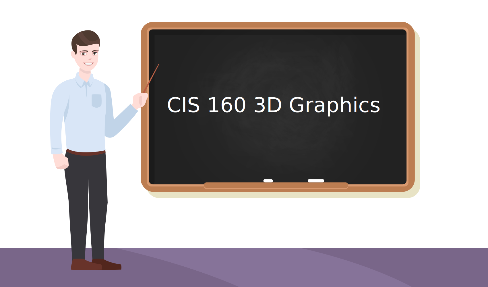

Today we will introduce the course. Talk about communicating through art
using the movie Sintel as an example. Finally we'll learn some technical skills
in running Blender.

Introduction
------------

* Go over syllabus

* This class uses some video tutorials.
  Why are we using video tutorials?

  * You can easily stop and replay the video if you didn't catch where to click
    or what key to hit.
  * It keeps other people from being halted when someone has a question.
  * Videos allow for self-paced study. Not everyone is going to learn this at
    the same speed.
  * They free up the instructor to have more time to answer questions.
  * It allows students to customize what topics are learned. Students can
    spend time on animation tutorials, tutorials on modeling a face,
    texturizing, etc.
  * There are a lot of high-quality tutorials out there, no need to re-invent
    the wheel.
  * People who are away for sports during May Term can stay caught up.

* How much work is expected?

  * Be in class every day, all during the class time.
  * Do not leave class early.
  * Plan to spend at least two hours per day learning and creating with 3D
    graphics outside of class. More if you want to get an A.
  * There are enough materials to keep someone occupied for years learning
    Blender. There will be no problem finding enough material to learn.

.. _principles:

Principles and Elements of Art
------------------------------

(TBD: Get some books and read up on this. Put in some sample art. Create my own version of things like:)

http://www.vwarthistory.com/elements-and-principles.html
https://drawpaintacademy.com/principles-of-art/

An artist can convey a **message** using visual cues. A limp can communicate a past
injury for example.

An artist can also convey an **aesthetic response**.
An aesthetic response is a feeling.
A photo of beautiful spring flowers can evoke a feeling of happiness and hope.
A run-down cyber-punk cityscape can evoke a feeling of despair.

We can communicate an aesthetic response based on certain **artistic elements** and **principles**.

* Color

  * What colors communicate what aesthetic?
  * A color can be light or dark. How does that change things?
  * A color can be bright and pure, or dull.

* form
* line
* shape
* space
* texture/pattern/rhythm

  * Texture - how do you think things would feel if you touched them? https://3dtextures.me/

* scale
* proportion
* unity/variety
* movement
* mass
* balance (symmetry, asymmetry, radial symmetry)
* contrast (difference between objects)
* volume
* perspective (camera angles)
* depth (focus/depth of field)

.. _sintel:

How did Sintel Use Art to Communicate?
--------------------------------------

* View `Sintel movie <http://www.sintel.org/>`_ on
  `YouTube <https://www.youtube.com/watch?v=eRsGyueVLvQ>`_.
  Sintel was created with Blender back in 2011.
* Examine video stills (below) from movie. What is being conveyed? How?
* What to look for:

  * Lighting
  * Shapes
  * Camera angles
  * Position in the frame
  * Focus/depth of field
  * Color
  * Blur
  * Reflectivity
  * Posture
  * Facial expression
  * Eyes
  * Eyebrows
  * Mouth

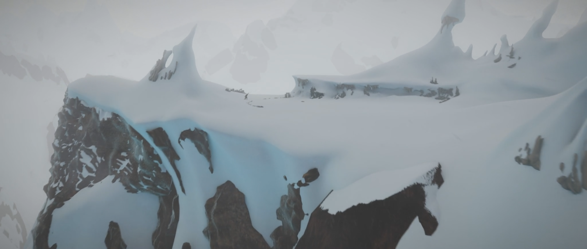

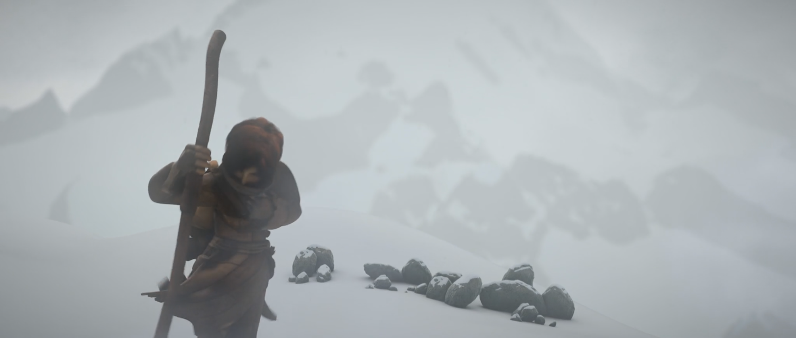

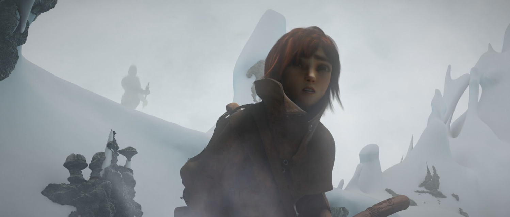

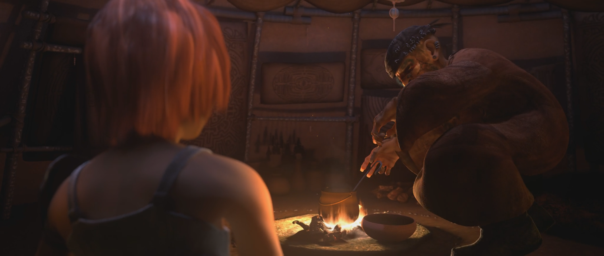

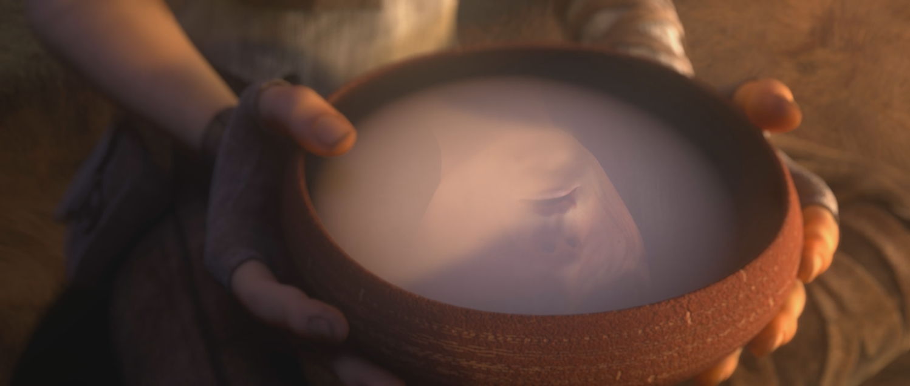

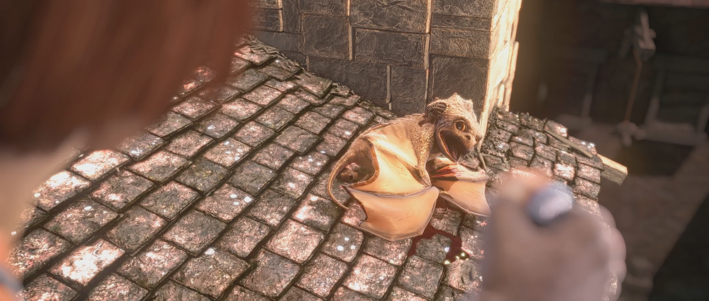

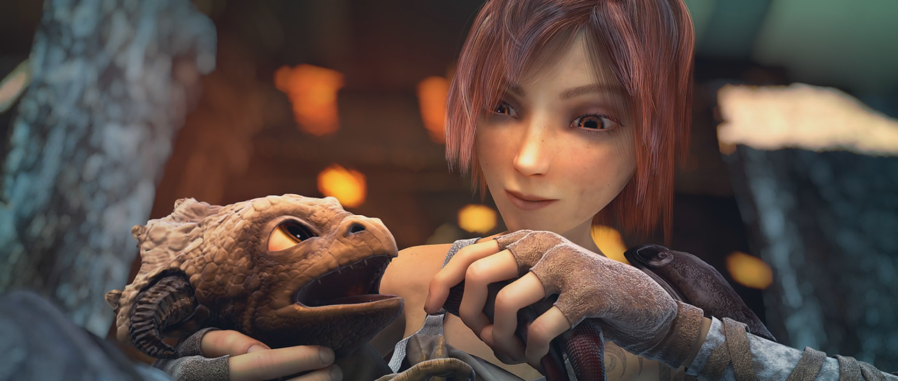

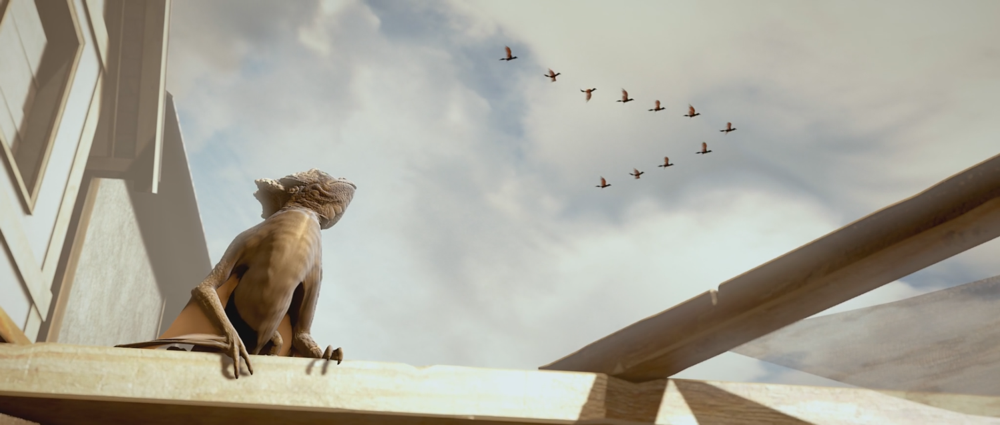

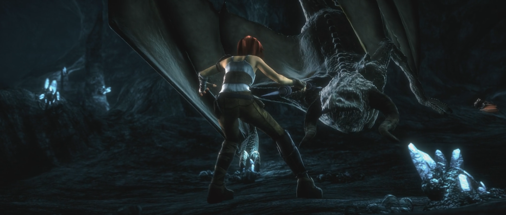

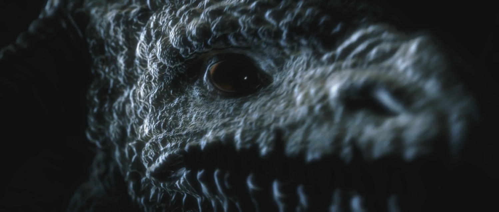

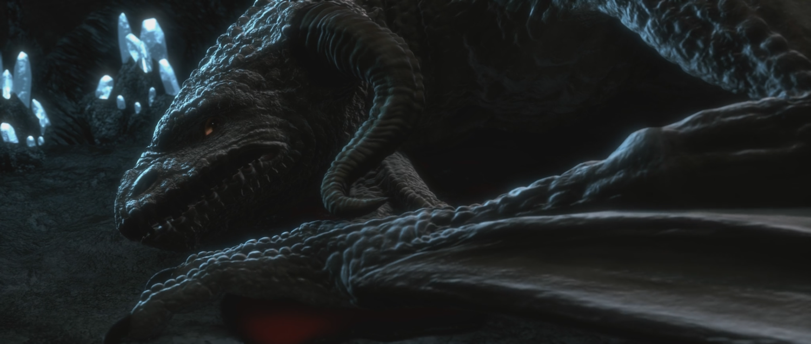

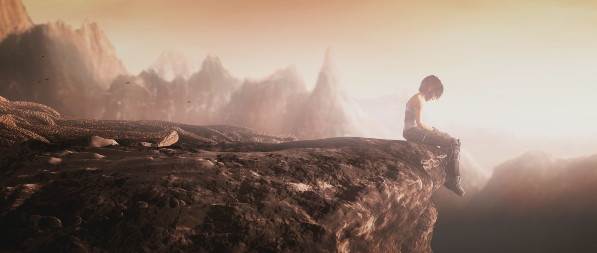

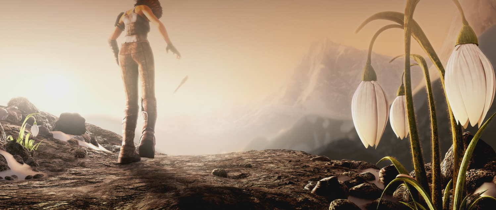

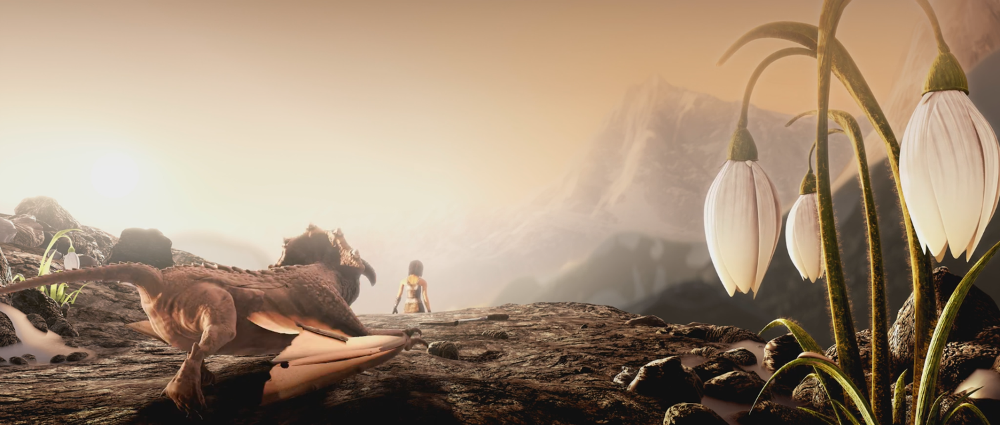

For :ref:`Assignment_01` I am looking for you to pick an image and do the same
type of analysis. Look at the types of things we called out in the images, and
write up what the artist's message was by using these cues.

Looking Forward
---------------

* Go over the :ref:`final_project` so you know where we are headed for the course.
* Go over :ref:`Assignment_02` so you know where we are headed today.
* There will be about nine assignments before the final project.
* There is a lot of detail work you can do with either assignment. If you find
  yourself done early, just spend more time creating and perfecting things in
  the assignments.

Videos to Watch
---------------

These are from the
`Blender Basics Course <https://cgcookie.com/courses/blender-3-basics-intro-to-blender>`_
Make sure you take your time and completely understand everything in these videos.
You'll use it every day from here to the end of class.

* `Intro to Blender and CG Cookie (9 min) <https://simpsoncollege.hosted.panopto.com/Panopto/Pages/Viewer.aspx?id=b11863bb-7e9a-43cf-a477-ae84010019b2>`_
* `Navigating the 3D View (7 min) <https://simpsoncollege.hosted.panopto.com/Panopto/Pages/Viewer.aspx?id=888230a4-610d-4233-baf1-ae840101ff13>`_
* `Selecting Objects (6 min) <https://simpsoncollege.hosted.panopto.com/Panopto/Pages/Viewer.aspx?id=c539d2c0-fbd0-425f-9017-ae840101ffbd>`_
* `Transforming Objects and Adjusting Operations (13 min) <https://simpsoncollege.hosted.panopto.com/Panopto/Pages/Viewer.aspx?id=c5735e3c-129b-490b-9523-ae840101fed5>`_
* `Adding, Deleting, and the 3D Cursor (11 min) <https://simpsoncollege.hosted.panopto.com/Panopto/Pages/Viewer.aspx?id=4d463b74-2faa-4aae-92de-ae8401020780>`_
* `Local Space and Parenting (12 min) <https://simpsoncollege.hosted.panopto.com/Panopto/Pages/Viewer.aspx?id=c412facc-7b54-428d-b61a-ae840101ff46>`_
* `Primitive Modeling Exercise (6 min) <https://simpsoncollege.hosted.panopto.com/Panopto/Pages/Viewer.aspx?id=77c7c093-e062-47bf-950e-ad1a00edc844>`_

Assignments
-----------

Due Wednesday morning, but I suggest treating the assignments like they are due
Tuesday morning. There will be more assignments on Wednesday, and the work
Wednesday assumes you know this stuff.

* :ref:`Assignment_01` - Apply what we learned about
  interpreting how the artist delivered their message.
* :ref:`Assignment_02` - Demonstrate you learned about basic Blender manipulation
  of objects.

