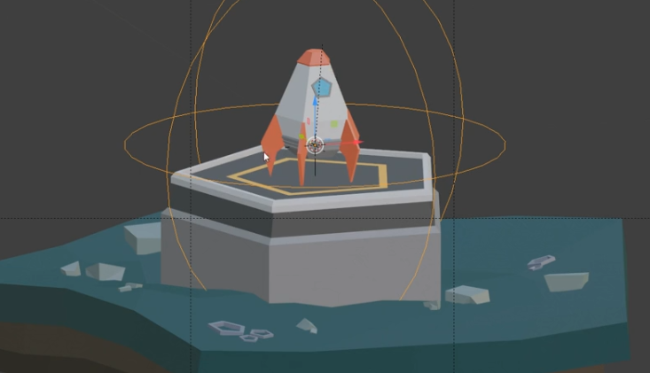

Day 2 - Mesh Modeling Introduction
==================================

Today we'll be looking at the "rule of thirds",
and work through video lessons that get us started in mesh modeling
by creating a rocket.

Due tomorrow:

* :ref:`Assignment_01`
* :ref:`Assignment_02`

A new assignment will be due Wednesday:

:ref:`Assignment_03`

We will spend tomorrow on additional lessons in mesh modeling and another
mesh modeling assignment.

Rule of Thirds
--------------

Talk about the `Rule of Thirds`_.

.. figure:: RuleOfThirds-SideBySide.gif

   An image cropped with and without the rule of thirds. [#f1]_

Take a look at the images from :ref:`sintel` and see how they use "The Rule of Thirds."

.. _Rule of Thirds: https://en.wikipedia.org/wiki/Rule_of_thirds

Changing a Scene
----------------

Talk about the following two images:

.. figure:: 34807_1297991665_large.jpg

  "`Somewhere in Japan <http://shotta.cgsociety.org/art/3ds-max-digital-fusion-photoshop-vray-zbrush-somewhere-in-japan-958529>`_" by Miguel Cruz

.. figure:: 34807_1297992639_large.jpg

  "`Somewhere in Japan Sunset Version <http://shotta.cgsociety.org/art/3ds-max-digital-fusion-photoshop-vray-zbrush-somewhere-in-japan-958534>`_" by Miguel Cruz

Discuss the following points:

* How does the mood change between the sunset and daytime photo?
* What does the artist change in the scene to make things different? List them.
* What items are the same, that might not first be obvious?
* One of the things that a good 3D artist can do to be more effective is reuse
  assets. You can see this in movies where movie sets and props are reused
  in different movies. This is even easier with 3D graphics. Take some time
  to list the different "assets" from this scene that the author could reuse
  somewhere else.

  Explore assets from:

  * `Quixel Megascans <https://quixel.com/megascans/home?category=3D asset>`_
  * `BlenderKit <https://www.blenderkit.com/>`_
  * `SketchFab <https://sketchfab.com/tags/blender>`_
  * `BlenderMarket <https://blendermarket.com/categories/models>`_

Intro to Mesh Modeling
----------------------

Rather than just work with primitives objects, like cubes and spheres,
we want to edit and create our own shapes. This group of points, lines, and planes
is called a **mesh**.

While these mesh modeling tutorials were made with Blender 2.8,
they still work fine with our current Blender. You'll notice a few changes in the interface,
but it should still be easy for follow.

The videos are from CG Cookie's `Build and Animate a Low Poly Rocket in Blender for Beginners <https://cgcookie.com/courses/build-and-animate-a-low-poly-rocket-in-blender-for-beginners>`_

Mesh modeling
^^^^^^^^^^^^^

* `Intro to Mesh Modeling in Blender <https://simpsoncollege.hosted.panopto.com/Panopto/Pages/Viewer.aspx?id=ebe9f2fe-f366-45a4-9a76-ad1a00fafade>`_
* `Exploring Edit Mode <https://simpsoncollege.hosted.panopto.com/Panopto/Pages/Viewer.aspx?id=198dd01d-8bff-43bd-939e-ad1a00fafae9>`_
* `Adding and Removing Vertices <https://simpsoncollege.hosted.panopto.com/Panopto/Pages/Viewer.aspx?id=0702e6f3-bc65-4edf-a57a-ad1a00fafa6b>`_
* `Mesh Modeling Tools <https://simpsoncollege.hosted.panopto.com/Panopto/Pages/Viewer.aspx?id=9e352e97-ac5f-4df6-91b3-ad1a00fafa53>`_

.. _building_a_rocket:

Rocket Building
^^^^^^^^^^^^^^^

* `Modeling the Rocket <https://simpsoncollege.hosted.panopto.com/Panopto/Pages/Viewer.aspx?id=936bad6f-6dc4-43d2-b919-ad1c01524550>`_
* `Adding Thrusters and Fins <https://simpsoncollege.hosted.panopto.com/Panopto/Pages/Viewer.aspx?id=a5999839-e8cc-4ae6-b166-ad1c01522ca1>`_
* `Adding Color to our Rocket <https://simpsoncollege.hosted.panopto.com/Panopto/Pages/Viewer.aspx?id=17935274-ba14-40c2-a6a3-ad1c015283ca>`_
* `Modeling the Launch Pad <https://simpsoncollege.hosted.panopto.com/Panopto/Pages/Viewer.aspx?id=2dbcd729-9292-418c-9035-ad1c01522ccd>`_
* `Building the Environment <https://simpsoncollege.hosted.panopto.com/Panopto/Pages/Viewer.aspx?id=2c75ffdb-d857-4640-842f-ad1c01522d08>`_
  (At one point, you use a Subdivision modifier in this tutorial. It is necessary to turn off optimal modifier. If when you extrude, your landing pad slopes down instead of staying level, select 'median point' instead of '3D cursor' at the top. Ask the instructor where this option is.)

Have extra time? Really into doing 3D? Here are some extra things you can work
on. (They don't count towards the grade, but are great for learning more.)

* `Animating the Rocket <https://simpsoncollege.hosted.panopto.com/Panopto/Pages/Viewer.aspx?id=0e6511b7-7e50-4f1d-b3ec-ad1d01281e88>`_

Assignment 3
------------

Turn in your rocket, created from the tutorials. :ref:`assignment_03`.

References
----------

.. [#f1] "`Pir6mon <https://commons.wikimedia.org/wiki/File:RuleOfThirds-SideBySide.gif>`_". Wikimedia Creative Commons. Dec 2010. Retrieved 2021-05-02.
