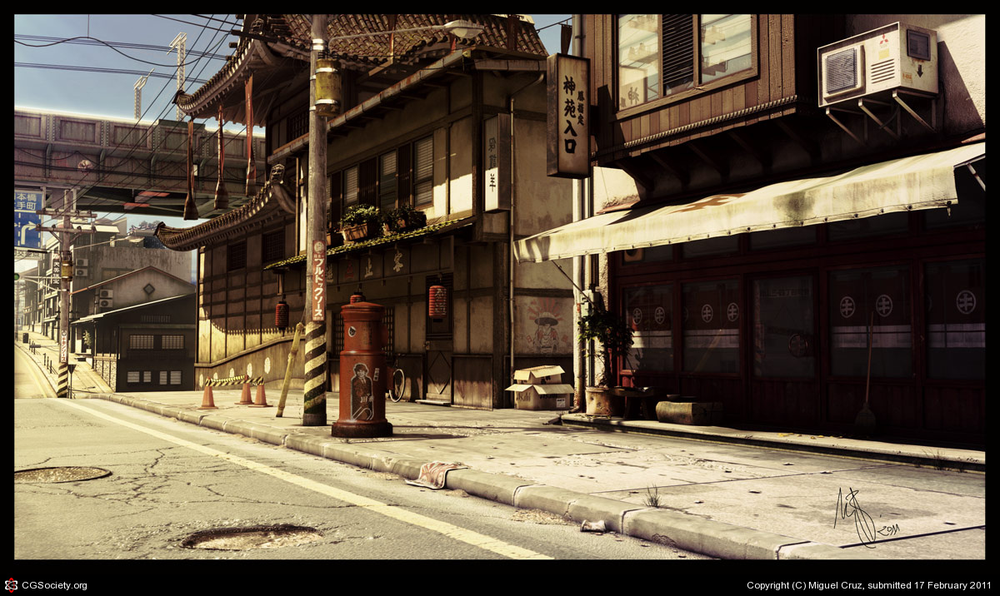
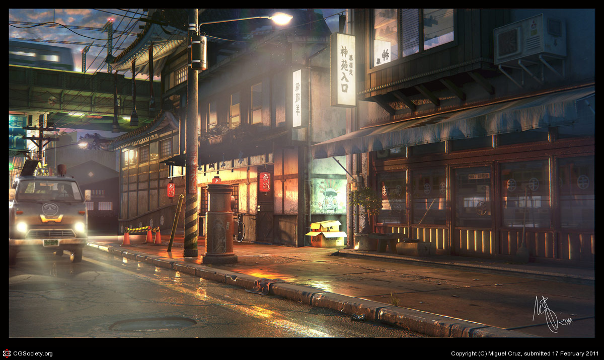

Day 02 - Meshes
===============

* ** Reminder:** Two assignments due tomorrow.
* Yesterday we talked about an artist's ability to convey a message. Remember
  to take a look at **what** the message was, and then **how** it was conveyed.
* Next we worked on videos that covered the basics of Blender and
  covered the basics adding primitive shapes to a scene.
* Blender is free and open-source. You can `download Blender <https://www.blender.org/download/>`_
  run it on your own computer without
  paying for anything.

Class Discussion
----------------

Rule of Thirds
^^^^^^^^^^^^^^

Talk more about the `Rule of Thirds`_.

.. _Rule of Thirds: https://en.wikipedia.org/wiki/Rule_of_thirds

Reusing Assets
^^^^^^^^^^^^^^

Talk about the following two images:

  "`Somewhere in Japan <http://shotta.cgsociety.org/art/3ds-max-digital-fusion-photoshop-vray-zbrush-somewhere-in-japan-958529>`_" by Miguel Cruz

  "`Somewhere in Japan Sunset Version <http://shotta.cgsociety.org/art/3ds-max-digital-fusion-photoshop-vray-zbrush-somewhere-in-japan-958534>`_" by Miguel Cruz

Discuss the following points:

* How does the mood change between the sunset and daytime photo?
* What does the artist change in the scene to make things different? List them.
* What items are the same, that might not first be obvious?
* One of the things that a good 3D artist can do to be more effective is reuse
  assets. You can see this in movies where movie sets and props are reused
  in different movies. This is even easier with 3D graphics. Take some time
  to list the different "assets" from this scene that the author could reuse
  somewhere else.

Learning Blender Plan
---------------------

The idea is to spend a week and a half on learning Blender. Then switch to
working on a final project. Depending on your prior experience, you may be able to
more or less material than others. That's ok. But you do need to cover at
least the core videos.

Required Tutorial Videos
^^^^^^^^^^^^^^^^^^^^^^^^

* `Blender Basics <https://cgcookie.com/course/blender-basics/>`_
* `Mesh Modeling Fundamentals <https://cgcookie.com/course/mesh-modeling-fundamentals/>`_
* `Fundamentals of Texturing <https://cgcookie.com/course/introduction-to-texturing/>`_
* `Shading <https://cgcookie.com/course/shading-fundamentals-in-cycles/>`_
* `Lighting <https://cgcookie.com/course/fundamentals-of-lighting/>`_
* `Modeling with Modifiers <https://cgcookie.com/course/modeling-with-modifiers/>`_
* `Fundamentals of Animation <https://cgcookie.com/course/fundamentals-of-animation/>`_ Animation tools only, NOT principals of animation.
* `Fundamentals of Rendering <https://cgcookie.com/course/introduction-to-rendering/>`_ Chapter 1 and 2 only are required, but the others are good if you've got the time.

Secondary Priority Videos
^^^^^^^^^^^^^^^^^^^^^^^^^

* `Rigging <https://cgcookie.com/course/fundamentals-of-rigging/>`_
* `Sculpting <https://cgcookie.com/course/fundamentals-of-digital-sculpting/>`_
* `Dynamics <https://cgcookie.com/course/fundamentals-of-dynamics/>`_

After this, split out and learn some other things. CG Cookie has 81 different
courses you can go through:

    https://cgcookie.com/courses/?fwp_division=blender

What's Next?
^^^^^^^^^^^^

By now, you definitely should have finished out the Blender Basics.
I hope you've finished or nearly finished the Mesh Modeling Fundamentals.

I've felt these are reasonably straight forward. The next thing CG Cookie
has on their plan is the Fundamentals of Texturing.

The plan is to work on this texturing
next. In the past when I taught this class I didn't usually cover this until
later. Mostly because my reaction to
UV unwrapping, even after several years, has always been:

But CG Cookie has this up earlier in their flow.
I'm not exactly sure how this part of the course will go.
I'm not sure how long it will take.
I'll randomly
drop in on some of you and see how it is going. Please realize this isn't
a test of you, but a test of the course.

The overall concept of this is easy. How do you paint a 3D object? Give it color?
Give it life? Somehow we need to turn a 3D object into a 2D object that we can
paint on using a paint program.

Think of it as using wrapping paper. Wrapping a book is easy. A cube not as
easy. A sphere is hard. How about a person? Complex shapes get very hard.

We call this `UV Unwrapping`_ or UV Mapping.

.. _UV Unwrapping: https://en.wikipedia.org/wiki/UV_mapping

Next, the tutorial talks about how to "paint" on this unwrap so that you
can add color to your 3D objects. After that, it talks about how you can
paint not just on the 2D unwrap, but you can also paint on the 3D object
itself. But wait! You by default that stuff isn't saved, so you need to
go through the video on how to save your painting of the object.

The next part that the tutorial covers is "baking." Baking helps add shadows to
the part of the object that light doesn't easily reach. This is great if you
want to make your object look realistic, and add dirt and wear to those
cracks and crevices.

At some point you may want to use an external painting program. Adobe
has good apps, there is Gimp, or even the built-in Microsoft paint. The
tutorial shows you how to do that.

The end point on where we want to be, can you paint a 3D object? If you can
do the exercise `Painting an Axe`_ then you've learned enough of this section.

.. _Painting an Axe: https://cgcookie.com/exercise/texture-painting-an-ax/

Need a Break?
-------------

Wait! Have you had your fill of tutorial videos? Take a break. But goof off by
doing something your instructor approves of.

Browse CG Art
^^^^^^^^^^^^^

* I've checked out copies of `3D World Magazine`_ from the library.
  I'll have them here in class for a while. Look through them.
* Browse the `CG Cookie Gallery`_.
* Spend time browsing `CG Society`_ to get ideas.
* Go through `Sketchfab`_ and look for things.

.. _CG Society: http://www.cgsociety.org/
.. _CG Cookie Gallery: https://cgcookie.com/gallery/
.. _3D World Magazine: http://www.creativebloq.com/3d-world-magazine
.. _Sketchfab: https://sketchfab.com/

Experiment
^^^^^^^^^^

Also, don't hesitate to take a break from the video by experimenting with a
side project. Even if you end up trashing it, you'll still have learned
something.

But don't think to yourself "I'm going to model a city!" Model something simple.
Model a street lamp. A fire hydrant. Any of these could be things that you use
in a city.

Modeling people or animals is hard. I suggest starting with inanimate objects.

Assignment 3
------------

Talk about :ref:`assignment_03`.
