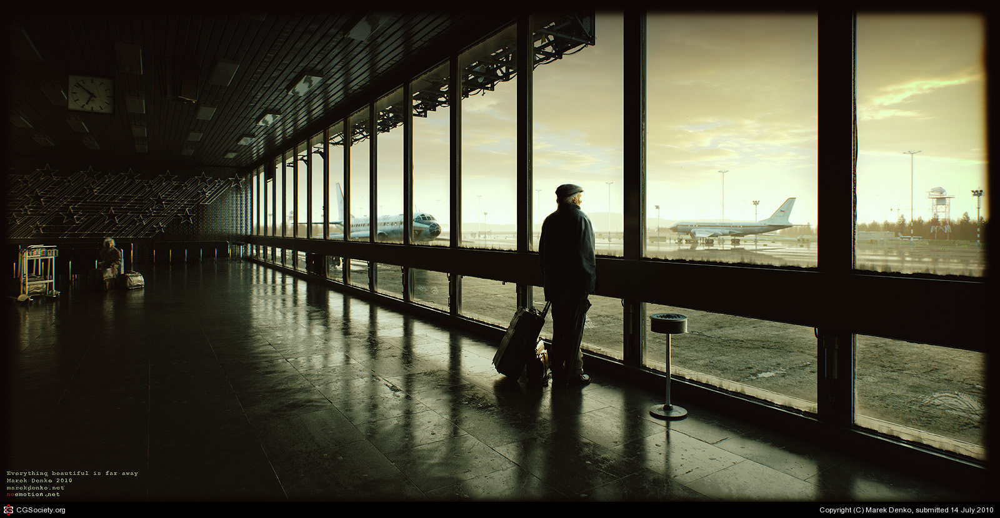

Day 3 - Mesh Modeling Deep Dive
===============================

Today we'll talk about creating a backstory for an art piece, and also a bit
about color theory.

**Reminder:**

* :ref:`Assignment_01` and :ref:`Assignment_02` were due at the start of class today (Wednesday).
* :ref:`Assignment_03` is due tomorrow (Thursday) at 8:30 am.
* A new assignment, :ref:`Assignment_04`, is due in two days (Friday) at 8:30 am.
* A new assignment, :ref:`Assignment_05`, is due next week, Tuesday, at 8:30 am.

.. _backstory:

Telling a Story
---------------

In :ref:`assignment_01` and :ref:`sintel`
we talked about artists can communicate specific messages, and even
emotions using art.

Good art can tell an *entire story*. Let's practice.

Take a look at this image.
Brainstorm some ideas on what the backstory could be here. What happened
before this image, to bring it about?

1. First, pick up cues from the image. List those items in the image that hint to a story.
2. Next, list what aspects of a story that could explain why those elements are in the image.
3. Finally, how do those elements fit together?

   Image from Amir Hossein Ghasemi [#f2]_

Got the idea? Great! Let's try it again.

   Image from Javier Diaz [#f3]_

Here is an example of an image, and a story that goes with it.

    Image by Marek Denko

Sample Story
   James glanced at his watch, quarter to seven, he thought, where does the time go?  With a sigh, he extinguished his
   cigarette and flicked it into the terminal's ashtray.  Leaning on his umbrella for support, James made his way to
   the windows for a closer look at the metallic bird that would soon carry him to his next home.  Carefully, he
   surveyed the room from the reflection on the glass, but he saw no sign of anyone suspicious. How much longer will
   they chase? It’s been thirty years. In his prime, James had been a man with the ability to infiltrate buildings with
   ease.  His skill-set was so great that he had been nearly set for life by 24.  One last job was all it was going to
   take. Fifteen minutes in and out, no one around, a lightweight mark, and a fence already set up.  Everything went
   smoothly for the first ten minutes, and then all hell broke loose.

   Ten minutes to seven. A voice came over the intercom announcing boarding would begin in five minutes.  James hobbled
   down the row of windows, taking notice of an older woman sitting in the seats.  Being careful to keep his full face
   from view, he caught her reflection in the glass, that’s odd… She seems almost familiar.  Cautiously, James turned
   back to the planes, five more minutes and he would be boarded.  Off to the next country to pick up a cache and go
   into hiding once more.  As he reached up to adjust his hat, he heard a click and a soft voice speaking behind him,
   "It’s been a long while, James."

See :ref:`Assignment_04` where you'll create your own backstory to an image.

Technical
---------

Fonts
^^^^^

Before we talk about color, let's talk about
`the difference between serif and sans serif <https://www.fonts.com/content/learning/fontology/level-1/type-anatomy/serif-vs-sans-for-text-in-print>`_.

Talk about color and text. Note text of news sites like:

  * `Washington Post <https://www.washingtonpost.com/>`_
  * `Fox News <http://www.foxnews.com/>`_
  * `Wall Street Journal <https://www.wsj.com/>`_
  * `New York Times <https://www.nytimes.com/>`_

Always, white text on black, or black on white. Avoid colored backgrounds or text.

Color Theory
^^^^^^^^^^^^

* Talk about `color theory`_.
* Talk about creating color schemes. Look at `Adobe Kuler`_.

.. _Adobe Kuler: https://color.adobe.com/create/color-wheel/
.. _color theory: http://www.worqx.com/color/index.htm

Understanding Polygon Count
^^^^^^^^^^^^^^^^^^^^^^^^^^^

Polygons:

* What is a triangle?
* A quad?
* An n-gon?
* `How to see polygon/vertex count <https://blender.stackexchange.com/questions/192990/polygon-and-vertices-count-for-blender-2-9>`_

Advanced Mesh Modeling Tutorial Videos
--------------------------------------

Some of the videos uses a chair. To follow along,
`download the chair here <../../_static/chair.zip>`_ and open in Blender.
I highly recommend trying out the concepts demonstrated. Just watching rarely
builds the needed skills.

I've rated each video on importance, high or low.

Pre-Modeling Basics
^^^^^^^^^^^^^^^^^^^

* `Edit Mode Selection and Deleting (9 min - high) <https://simpsoncollege.hosted.panopto.com/Panopto/Pages/Viewer.aspx?id=6d7715f5-7f65-4074-91d2-ad1d0133b64c>`_
* `Object and Mesh Data (8 min - high) <https://simpsoncollege.hosted.panopto.com/Panopto/Pages/Viewer.aspx?id=ec81e42f-bf63-4581-8a02-ad1d0133c564>`_
* `Transform Orientations (10 min - high) <https://simpsoncollege.hosted.panopto.com/Panopto/Pages/Viewer.aspx?id=a16a76c2-304f-427f-b60a-ad1d0133b672>`_
* `The Normal Direction (8 min - low) <https://simpsoncollege.hosted.panopto.com/Panopto/Pages/Viewer.aspx?id=8ab43a88-d61b-4358-b24a-ad1d0133b62d>`_
* `Gimbal, View, and Cursor Directions (1 min - super low) <https://simpsoncollege.hosted.panopto.com/Panopto/Pages/Viewer.aspx?id=3c82db82-7175-4cd6-9b5c-ad1d0133b699>`_
* `Pivot Points (10 min - med) <https://simpsoncollege.hosted.panopto.com/Panopto/Pages/Viewer.aspx?id=2e94f6b1-69b7-491d-81fa-ad1d013da215>`_
* `Smooth, Flat, and Custom Normals (6 min - high) <https://simpsoncollege.hosted.panopto.com/Panopto/Pages/Viewer.aspx?id=aa2d85d8-3a77-47de-8518-ad1d013da1b5>`_
* `Mesh Shading and Visibility (7 min - med) <https://simpsoncollege.hosted.panopto.com/Panopto/Pages/Viewer.aspx?id=36c18d7f-b1a3-4b3e-bb91-ad1d013da240>`_

Modeling Basics
^^^^^^^^^^^^^^^

* `Finding Modeling Methods (10 min - First half high, second low) <https://simpsoncollege.hosted.panopto.com/Panopto/Pages/Viewer.aspx?id=59e1390e-284d-4fa7-bb1c-ad1d013da1e7>`_
* `Subdivide (5 min - high first 2/3) <https://simpsoncollege.hosted.panopto.com/Panopto/Pages/Viewer.aspx?id=969da56d-9c5a-488f-9fbd-ad1d01442385>`_
* `Loop Cut and Slide (7 min - high) <https://simpsoncollege.hosted.panopto.com/Panopto/Pages/Viewer.aspx?id=786d865b-bd36-4e48-a933-ad1d01442344>`_
* `Extrude (13 min - high) <https://simpsoncollege.hosted.panopto.com/Panopto/Pages/Viewer.aspx?id=5d7046ec-777a-4b79-90bc-ad1d01442319>`_
* `Inset (5 min - med) <https://simpsoncollege.hosted.panopto.com/Panopto/Pages/Viewer.aspx?id=df4215b3-d680-4969-9278-ad1d0159d1a2>`_
* `Bevel (4 min - med) <https://simpsoncollege.hosted.panopto.com/Panopto/Pages/Viewer.aspx?id=930ba5a9-d049-430c-8d03-ad1d0159d256>`_
* `Knife (9 min - low) <https://simpsoncollege.hosted.panopto.com/Panopto/Pages/Viewer.aspx?id=30e0c552-c6c5-42db-a8c7-ad1d0159d1d3>`_
* `Fill and Connect (8 min - high for the basic 'F' fill, low for the rest) <https://simpsoncollege.hosted.panopto.com/Panopto/Pages/Viewer.aspx?id=2a4dbd05-bbb2-48f7-a00b-ad1d0159d20c>`_

Optional Advanced Modeling
^^^^^^^^^^^^^^^^^^^^^^^^^^

I don't recommend watching these, simply because it would take to much time and
might be quite fatiguing to watch so much in one day. However, if you are really
enjoying learning 3D, I've left them in as optional.

* `Snapping (9 min) <https://simpsoncollege.hosted.panopto.com/Panopto/Pages/Viewer.aspx?id=327ee5e0-3767-48fe-9774-ad1d015ee337>`_
* `Proportional Editing (9 min) <https://simpsoncollege.hosted.panopto.com/Panopto/Pages/Viewer.aspx?id=082baaa3-cba9-4090-ad0a-ad1d015ed7dd>`_
* `Advanced Selection (9 min) <https://simpsoncollege.hosted.panopto.com/Panopto/Pages/Viewer.aspx?id=3bf32485-9758-45f3-8dce-ad1d015ed7b7>`_
* `Hiding and local View (9 min) <https://simpsoncollege.hosted.panopto.com/Panopto/Pages/Viewer.aspx?id=9d146454-619e-4305-a4a8-ad1d015ed79c>`_
* `Parenting (9 min) <https://simpsoncollege.hosted.panopto.com/Panopto/Pages/Viewer.aspx?id=a0debe1a-3796-437e-a63c-ad1d015ed80b>`_
* `Subdivision Surfaces (9 min) <https://simpsoncollege.hosted.panopto.com/Panopto/Pages/Viewer.aspx?id=02801973-b375-4615-a2e1-ad1d015ef343>`_

.. _model-bedroom:

Modeling a Low Poly Room
------------------------

This is the first part of :ref:`Assignment_05`. This assignment has you model a low
poly room. Later on, we'll add lighting and textures to it. Once both parts are
done you'll turn it in. For now, concentrate on the modeling part.

* `Modeling a Low Poly Room <https://simpsoncollege.hosted.panopto.com/Panopto/Pages/Viewer.aspx?id=58c02b24-4b02-43c9-b982-ad1d0159e0d7>`_

.. [#f2] "`Amir Hossein Ghasemi <https://cgsociety.org/c/featured/3n0q/beyond-the-valley>`_". Dec 2020. Retrieved 2021-05-04.
.. [#f3] "`Javier Diaz <https://bejavier.cgsociety.org/gkkk/montague-ratsbone-ii>`_". Mar 2021. Retrieved 2021-05-04.
