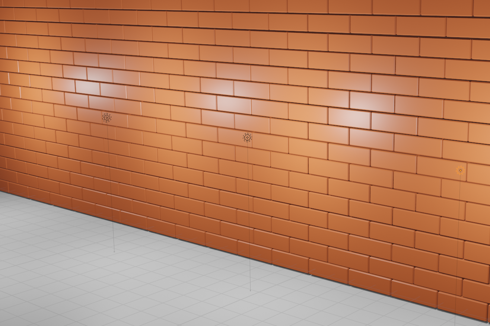
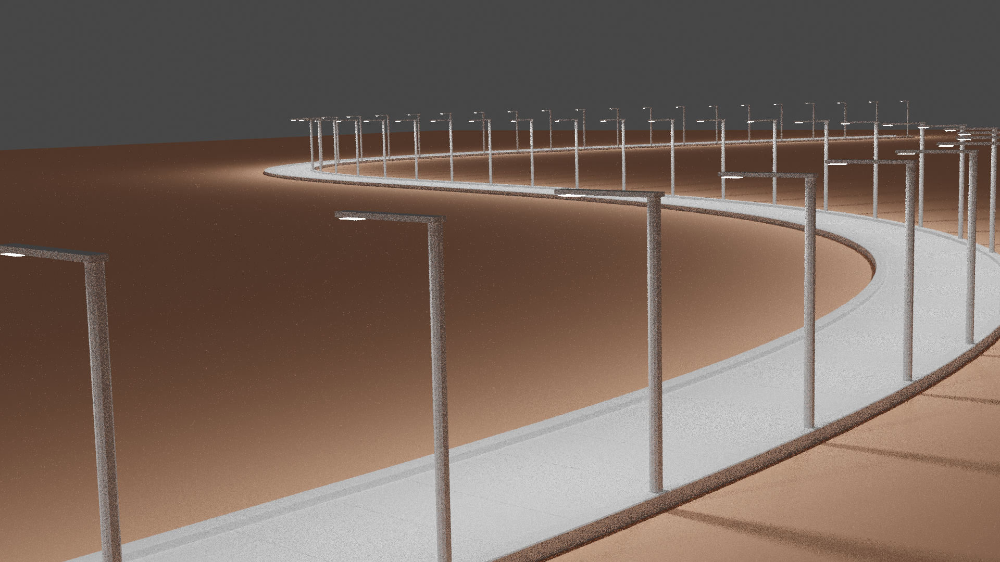
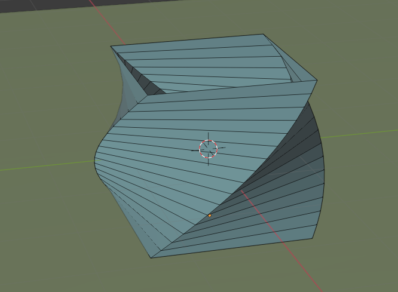
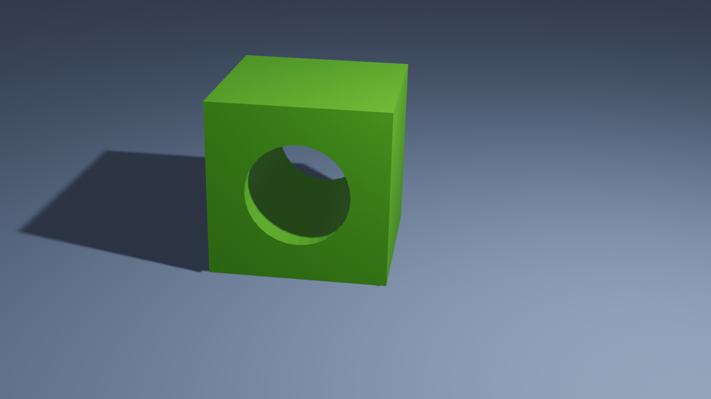
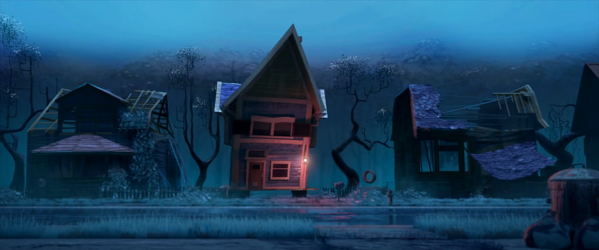

Day 6 - Project Plan / Modifiers
================================

Today we will be:

* Learning about **modifiers**.
* Look at some CG movie shorts and discuss them.
* Work on a project plan for the final project.

Modifiers
---------

Modifiers allow you to change an object in a non-destructive way. The original
object is unchanged, and you can move the modifiers around and change them.

Just another brick in the wall
^^^^^^^^^^^^^^^^^^^^^^^^^^^^^^

* Start with a brick
* Add a bevel modifier
* Use array modifier to make a row

  * Turn 'real time' on/off with bevel and array
  * Show how to make a gap (1.05 spacing)

* Use array modifier to make another row

  * Off set half size to make staggared wall.
  * See how it is 0.5 of the whole row? Grab and re-order
  * Now the offset includes the stagger. So change it

* Use array modifier to make pairs of rows
* Show how to use the Build modifier to make or destroy

The long and winding road
^^^^^^^^^^^^^^^^^^^^^^^^^

* Start with a cube
* Apply mirror modifier. Keep X axis. Talk about 'merge'

  * So many things are mirrored, this is quite useful.

* Flip to edit mode. Grab. X-Axis. Use '1' to move exact position.
* Extend, make a curb
* Add array modifier, make a road. Make it long.
* Add a curve

  * Top down view.
  * Add a path

* Add curve modifier

  * Set modifier to use curve
  * Set modifier to use y axis
  * May need to rotate object 90 degrees

* Talk about 'applying' a modifier

Screw modifier
^^^^^^^^^^^^^^

* Start with a flat plane
* Add the screw modifier

  * Add some distance

* Start with a plane

  * Take out two verticies
  * Make a ribbon

Boolean modifier
^^^^^^^^^^^^^^^^

* Use the Boolean modifier for a 'difference'
* Punch a hole through a cube

Displace modifier
^^^^^^^^^^^^^^^^^

Use the displace modifier to create ground.

Analyzing CG Movie Shorts
-------------------------

Watch the following:

* `Home sweet home <https://www.youtube.com/watch?v=-gz9-I_iEbY>`_
* `Pip <https://www.youtube.com/watch?v=07d2dXHYb94>`_
* `Dust Buddies <https://youtu.be/mZ6eeAjgSZI>`_

For each one, answer:

* What was the message?
* How did the artists convey that message?

Convey a Message
----------------

What are some 'messages' can be conveyed well through CG art?
List several.
These messages can sometimes be hard to describe in words, which is
why art is a powerful medium.

Follow up, pick a few of these messages. Then reverse the process
we've worked on before. How could you create CG art that conveys
this message?

Assignment 6 - Project Plan
---------------------------

Work on :ref:`Assignment_06`.