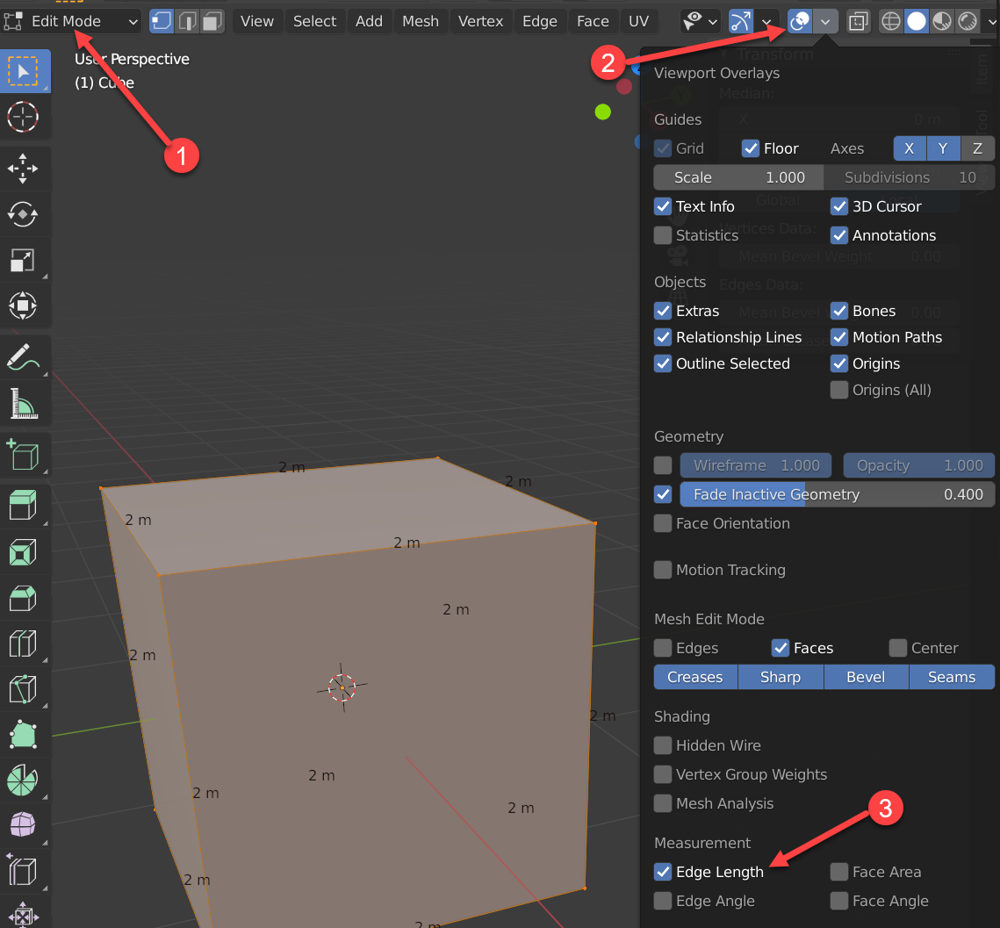

Day 8 - Rigging / Importing
===========================

Sizing
------

So far we've only tried to make an object's look correct when compared to other
objects. But what if you create a sofa that is 50 feet long, and scale the whole
house according to that? Or make it an inch long? Making objects to the wrong
scale can run into issues later when we import/export objects across different
scenes, when we add lighting, textures, and add physics simulations.

How do we get an idea how big our object is? A quick way is to open the sidebar
and see the object's dimensions. Here we can see out object is 2x2x2 meters.

.. image:: sidebar.png
   :width: 75%

That's just a rough guide though. Need more details? Switch to 'Edit Mode' (1)
then pull down the 'Show Overlays' menu (2) and finally select 'Edge Length' (3).
You'll now see the length of each edge.

Don't want to work in meters? No problem! Change your units here:

As you are making a mesh, make sure it is roughly the correct size.

Importing
---------

Objects can be created in separate ``.blend`` files, and then imported into
a single file to be rendered. This helps split work between people.

I suggest one ``.blend`` file per object. Have the object in the center,
keep the scale, translation, and rotation numbers at zero. Make the dimensions
of the object accurate.

Make sure the objects are named, that will make it easy import.

In your main Blender file, to import the object you want to select "Append".
Do **not** select "import". Import is used to import from other programs or
file formats. Not Blender file formats.

"Link" is very similar. It will bring in the object, but if you update the object
in the original file, it will show the updated object. Useful if you are going
to revise your object. But hazardous because it requires that linked file to be
there.

Once you've opened the file, you aren't done! You select what type of item
you want to import. You likely want to import from the "object" folder:

From there, you select the object you want to import:

Blendswap
^^^^^^^^^

There are websites like `Blend Swap <https://blendswap>`_ that let you upload
and download models. If you download a model, you have to cite it.

Working with a texture
----------------------

You can download tileable textures from websites like this:

https://tileable.co/

Remember, if you download it, you have to cite it.

I'm going to search on 'building' and use 'Cinder block bricks - design 4'

I'll show how to add the texture to a plane. I'll also show how to add the normal
and scale the texture.

.. _citing:

How to Cite Other's Work
------------------------

So, you are using downloaded HDRI files? Images? Textures? Models?
Want to give credit to that awesome tutorial you found?
Start keeping a reference list for your final project. It should be in MLA format
and look like this.

Bibliography for Sample Project
^^^^^^^^^^^^^^^^^^^^^^^^^^^^^^^

These are the resources used in creating Sample Project.

Models
~~~~~~

Slobang.
"Office Desk With Drawers"
*Blendswap.com*, March 14, 2021,
www.blendswap.com/blend/27597.
Accessed 11 May 2021.

drThunderbuckle.
"Lamp and desk"
*Blendswap.com*, February 10, 2020,
www.blendswap.com/blend/24404.
Accessed 11 May 2021.

Textures
~~~~~~~~

textures.com.
"BrickLargeBlocRks0039"
*textures.com*
www.textures.com/download/bricklargeblocks0039/120003.
textures.com. n.d.
Accessed 11 May 2021.

Tileable.co.
"Cinder block bricks - design 4"
*Tilable.co*
n.d.
Accessed 11 May 2021.

Tutorials
~~~~~~~~~

Proffitt, Kenan.
"Create a TNT Crate Model in Blender"
www.blendernation.com/2017/05/13/create-tnt-crate-model-blender
Blender Nation. 13 May, 2017.
Accessed 11 May 2021.

Rigging
-------

Instructor will do a quick rigging demo with armatures.

Here is a tutorial on armatures/rigging:
https://www.youtube.com/watch?v=cZ3o5tjO51s