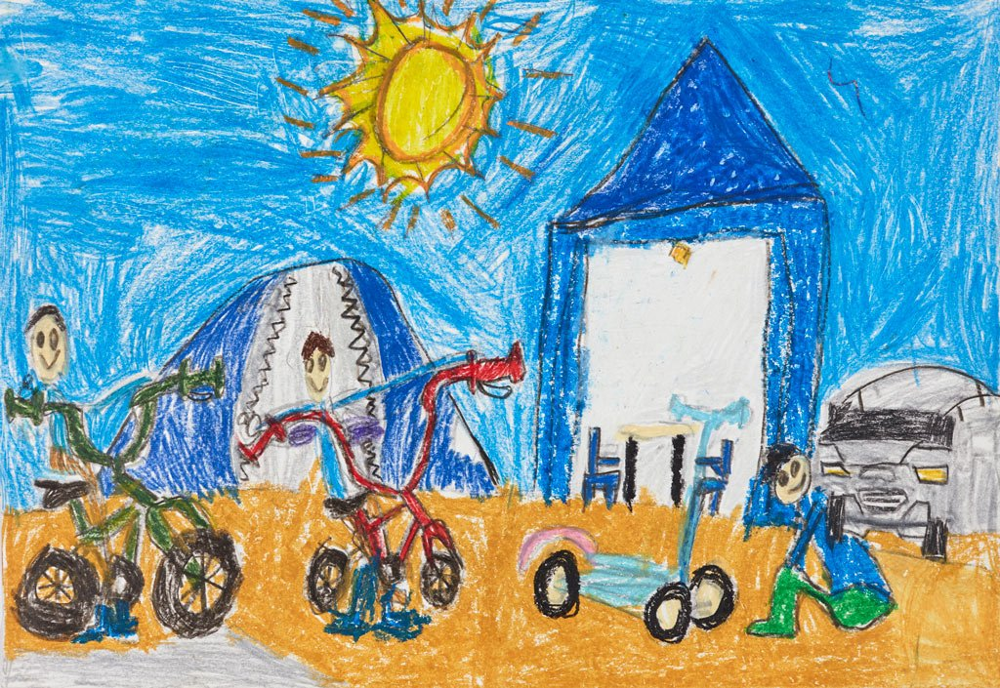

Day 09 - Rendering / What is Art?
=================================

Fine Art
--------
.. figure:: sunflowers.jpg

    By Vincent van Gogh - http://www.nationalgallery.org.uk/paintings/vincent-van-gogh-sunflowers/50136, Public Domain, https://commons.wikimedia.org/w/index.php?curid=31177739

    Hayden Jung, age 6 Holiday camping, pencil, crayon
    Winner of Art Gallary of South Wales contest
    https://www.artgallery.nsw.gov.au/members/current-members/kids-drawing-prize-2016/

    Charles Schultz, United Feature Syndicate

    By General Mills, Fair use, https://en.wikipedia.org/w/index.php?curid=8734649

Applied Art
-----------

.. figure:: building1.jpg

    Austrailian Museum of the Applied Arts

.. figure:: office.jpg

    Randall Fisher Construction Co

Performance Art
---------------

.. raw:: html

    <iframe width="560" height="315" src="https://www.youtube.com/embed/7WqKI3D2VaE" frameborder="0" allowfullscreen></iframe>

Music
-----

.. raw:: html

    <iframe width="560" height="315" src="https://www.youtube.com/embed/4rQSJDLM8ZE" frameborder="0" allowfullscreen></iframe>

.. raw:: html

    <iframe width="560" height="315" src="https://www.youtube.com/embed/kfVsfOSbJY0" frameborder="0" allowfullscreen></iframe>

`Rebecca Black's Friday Song <https://en.wikipedia.org/wiki/Friday_(Rebecca_Black_song)>`_

Why is Art Important?
---------------------

* From the standpoint of viewing art
* From the standpoint of expressing yourself in art
* From the standpoint of education
* From the standpoint of understanding/persuasion
