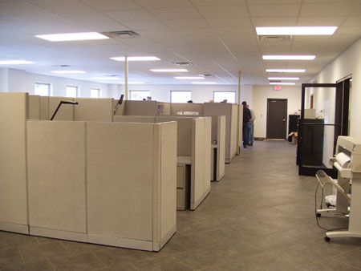

Day 10 - What is Art?
=====================

*This section hasn't been updated for 2021 yet.*

*This section hasn't been updated for 2021 yet.*

`What is Art? <https://en.wikipedia.org/wiki/Art>`_

Fine Art
--------

Why is this considered art? What makes it "good" art?

The famous painting below is by Vincent van Gogh.
He was not popular
in his time and died poor and unappreciated. Why is this art?

    By Vincent van Gogh - Public Domain,
    `Sunflowers, Wikipedia Commons <https://commons.wikimedia.org/w/index.php?curid=31177739>`_

Would the 6-year old's drawing below be considered art?
If it is art, is it good art?
What is the difference compared to Vincent van Gogh?
What makes art "good" or "bad"?

.. figure:: hayden.jpg

    Hayden Jung, age 6 Holiday camping, pencil, crayon
    `Winner of Art Gallary of South Wales contest
    <https://www.artgallery.nsw.gov.au/members/current-members/kids-drawing-prize-2016/>`_

Graphic design for commercial products. Is it art?

.. figure:: cheerios.jpg

    By General Mills, Fair use, `Wikipedia Commons <https://en.wikipedia.org/w/index.php?curid=87346499>`_

Are cartoons art?

.. figure:: Peanuts_gang.png

    Charles Schultz, United Feature Syndicate

Are political cartoons art?
`Search Google <https://www.google.com/search?q=political+cartoons&safe=active&source=lnms&tbm=isch&sa=X>`_
for some cartoons.
I find many of these cartoons to be offensive. Is that still art?

How about this, is it art?

    Royal Langnickel, Paint By Numbers

Applied Art
-----------

Can architecture be art? Let's say that this is art. Why is it art?

.. figure:: building1.jpg

    Austrailian Museum of the Applied Arts

Is this also art? If it isn't, why not?

    Randall Fisher Construction Co

What is the purpose of creating a building like the first one? The bottom
one is cheaper, and more energy efficient. When you buy things from the bottom
company, they aren't needlessly spending their money on extra building materials
like the top image.

.. figure:: capital.jpg

    `Wasteful and inefficient Iowa Capital building <http://maxpixel.freegreatpicture.com/Inside-Government-Iowa-Des-Moines-State-Capitol-1731557>`_

.. figure:: leds.jpg

    `Award winning interior of IPERS building <http://www.ledsmagazine.com/articles/iif/2012/12/iowa-government-building-slashes-electrical-load-70-with-acuity-lighting-and-controls.html>`_

Performance Art
---------------

.. raw:: html

    <iframe width="560" height="315" src="https://www.youtube.com/embed/7WqKI3D2VaE" frameborder="0" allowfullscreen></iframe>

Music
-----

.. raw:: html

    <iframe width="560" height="315" src="https://www.youtube.com/embed/4rQSJDLM8ZE" frameborder="0" allowfullscreen></iframe>

.. raw:: html

    <iframe width="560" height="315" src="https://www.youtube.com/embed/kfVsfOSbJY0" frameborder="0" allowfullscreen></iframe>

`Rebecca Black's Friday Song <https://en.wikipedia.org/wiki/Friday_(Rebecca_Black_song)>`_

Is singing in the shower/car performance art?

Why is Art Important?
---------------------

* From the standpoint of viewing art
* From the standpoint of expressing yourself in art
* From the standpoint of education
* From the standpoint of understanding/persuasion

Why support art?
----------------

* Why buy art?

  * Buy art at art fairs?
  * Buy tickets to movies?
  * Art and usage rights

* Why have public support for the arts?

  * Why have band, orchestra, and art at school?
  * Why have a "National Endowment for the Arts"?
  * Why force people to support art they don't agree with?
  * If people want art, shouldn't they just buy it?

Rendering
---------

Go over chapter 1 and 2 of the `rendering videos <https://cgcookie.com/course/introduction-to-rendering/>`_

Prep for Day 09
---------------

Start thinking about the question, "What is Art?" Here are two sources
to get you started:

* `Wikipedia <https://en.wikipedia.org/wiki/What_Is_Art%3F>`_
* `Mental Floss <http://mentalfloss.com/article/57501/27-responses-question-what-art>`_

Think, at what point do things in the following categories become art?

What about controversial art? Is it still art? If it offends, is it still ok?

Fine Art
^^^^^^^^

Drawing, sculpting, printmaking

* Cartoons (political cartoons, graphic novels, humor cartoons)
* A first-grader's drawing
* The design of a Cheerios box (or any other commercial-type work)
* Graffiti
* Penmanship

Music
^^^^^

* Classical music
* Rock music
* Pop music (Auto-tune?)

Visual/Performance Art
^^^^^^^^^^^^^^^^^^^^^^

* Theater (Acting can go from plays, Broadway, sitcoms, or even commercials)
* Ballet
* Poetry slams
* Flash mobs?

Applied Art
^^^^^^^^^^^

* Architecture (Frank Lloyd Wright to a cookie-cutter house)
* Design of things (chairs, lamps, etc.)

Decorative Art
^^^^^^^^^^^^^^

* Crafts

Animation
---------

Watch the "video tools" portion of the `Fundamentals of Animation`_ video series.
You do not need to watch the "animation principles" portion of the video.

Complete :ref:`Assignment_07`.

.. _Fundamentals of Animation: https://cgcookie.com/course/fundamentals-of-animation/
