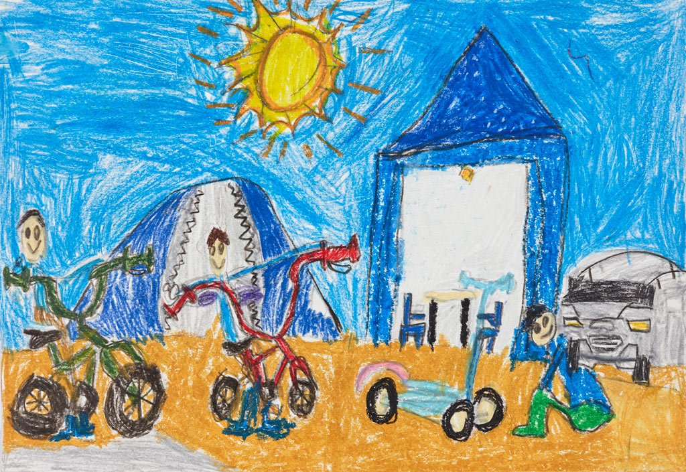
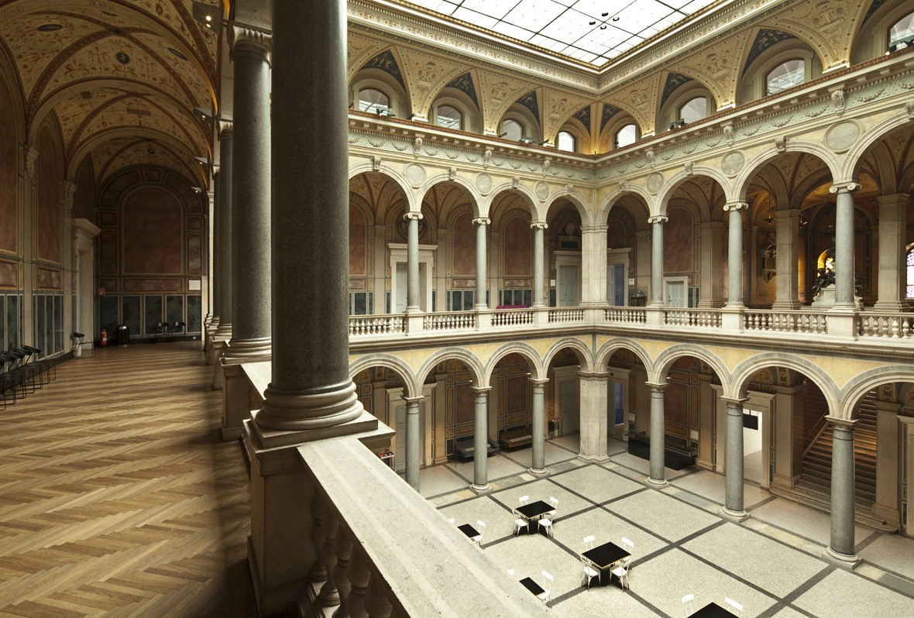
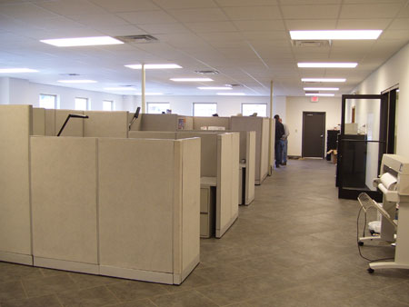
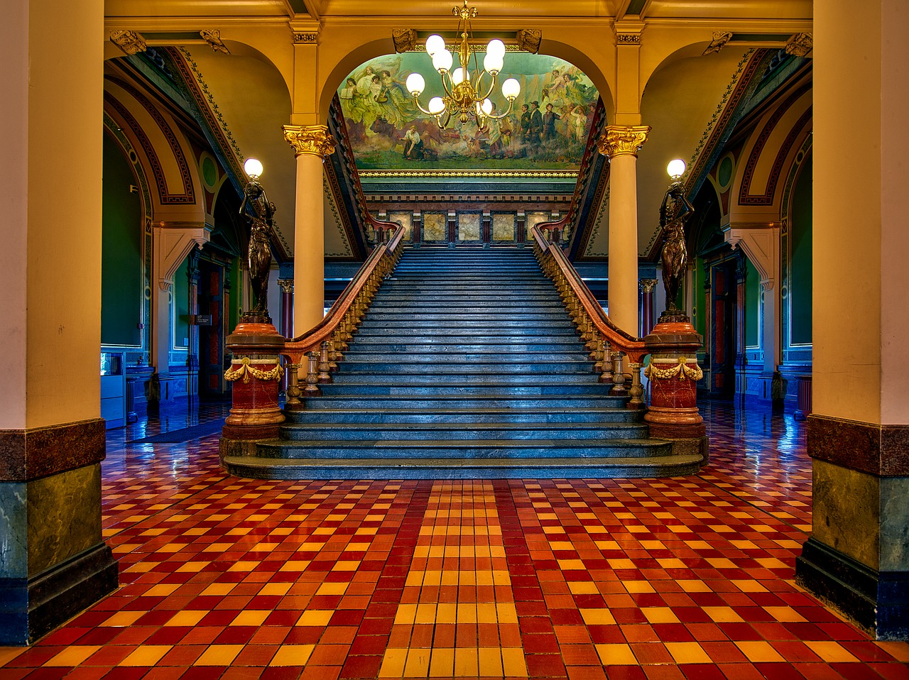
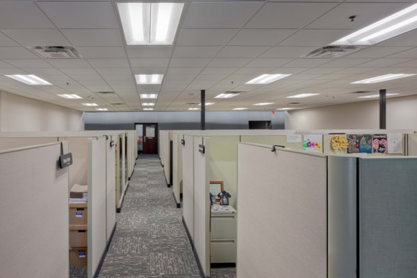

Day 11 - What is Art?
=====================

* `What is Art? <https://en.wikipedia.org/wiki/Art>`_
* `Mental Floss <http://mentalfloss.com/article/57501/27-responses-question-what-art>`_

Discuss
-------

* What categories of things are considered art?
* At what point does something become art?

Fine Art
--------

Why is this considered art? What makes it "good" art?

The famous painting
"`Sunflowers <https://www.vangoghmuseum.nl/en/collection/s0031V1962>`_"
below is by Vincent van Gogh.
He was not popular
in his time and died poor and unappreciated.
`Now, he is considered to be one of the greatest painters of all time <https://www.britannica.com/biography/Vincent-van-Gogh>`_.
Why is this art?
What do you think the artist is trying to communicate?

.. figure:: sunflowers.jpg

    By Vincent van Gogh - Public Domain,
    `Sunflowers, Wikipedia Commons <https://commons.wikimedia.org/w/index.php?curid=31177739>`_

Would the 6-year old's drawing below be considered art?
If it is art, is it good art?
What is the difference compared to Vincent van Gogh?
What makes art "good" or "bad"?

    Hayden Jung, age 6 Holiday camping, pencil, crayon
    `Winner of Art Gallery of South Wales contest
    <https://www.artgallery.nsw.gov.au/members/current-members/kids-drawing-prize-2016/>`_

Graphic design for commercial products. Is it art? If our message is to
"Buy Cheerios" is that still art?

.. figure:: cheerios.jpg
    :width: 70%

    By General Mills, Fair use, `Wikipedia Commons <https://en.wikipedia.org/w/index.php?curid=87346499>`_

Are cartoons art? From newspaper comics to graphic art novels?
Do things need to be serious to be considered art?

.. figure:: Peanuts_gang.png

    Charles Schultz, United Feature Syndicate

Are political cartoons art?
`Search Google <https://www.google.com/search?q=political+cartoons&safe=active&source=lnms&tbm=isch&sa=X>`_
for some cartoons.
I find many of these cartoons to be offensive. Is that still art?

How about this, is it art?

.. figure:: paint_by_numbers.jpg

    Royal Langnickel, Paint By Numbers

Is creating realistic looking paintings, drawings, or CG graphics art?
If realism is the ultimate goal, wouldn't a photograph be the king of artists?
(James McNeill Whistler)

Decorative Art
^^^^^^^^^^^^^^

What do you decorate your room with? What does it communicate? Why is it important?

* Flowers
* Crafts
* Posters

Applied Art
-----------

* Architecture (Frank Lloyd Wright to a cookie-cutter house)
* Design of things (chairs, lamps, etc.)

Can architecture be art? Let's say that this is art. Why is it art?

    Austrailian Museum of the Applied Arts

Is this also art? If it isn't, why not?
What message does this office layout convey, as opposed to the other
image?

    Randall Fisher Construction Co

What is the purpose of creating a building like the first one? The bottom
one is cheaper, and more energy efficient. When you buy things from the bottom
company, they aren't needlessly spending their money on extra building materials
like the top image.

    `Wasteful and inefficient Iowa Capital building <http://maxpixel.freegreatpicture.com/Inside-Government-Iowa-Des-Moines-State-Capitol-1731557>`_

    `Award winning interior of IPERS building <http://www.ledsmagazine.com/articles/iif/2012/12/iowa-government-building-slashes-electrical-load-70-with-acuity-lighting-and-controls.html>`_

Both of the above images are award-winning designs. The bottom one is efficient.
The top isn't.

The Carver building atrium was very controversial when it was designed. It was
a lot of wasted space. Was it worth doing? Is it art? What do you think of the
Kent student center atrium?

Visual/Performance Art
----------------------

* Theater (Acting can go from plays, Broadway, sitcoms, or even commercials)
* Ballet
* Poetry slams
* Flash mobs?

Does art need to be a physical thing? Why would we consider this to be art?

.. raw:: html

    <iframe width="560" height="315" src="https://www.youtube.com/embed/7WqKI3D2VaE" frameborder="0" allowfullscreen></iframe>

Music
-----

* Classical music
* Jazz
* Rock music
* Pop music (Auto-tune?)
* Rap music
* Country music

Music is incredibly important to people. Why? Why is it important to you?

This song was famous, mostly for all the wrong reasons. Would you consider
it art? Why or why not?

.. raw:: html

    <iframe width="560" height="315" src="https://www.youtube.com/embed/kfVsfOSbJY0" frameborder="0" allowfullscreen></iframe>

`Rebecca Black's Friday Song <https://en.wikipedia.org/wiki/Friday_(Rebecca_Black_song)>`_

Is singing in the shower/car performance art?

Why learn guitar or piano if you aren't going to play for other people?

Why is Art Important?
---------------------

* From the standpoint of viewing art
* From the standpoint of expressing yourself in art
* From the standpoint of education
* From the standpoint of understanding/persuasion

Why support art?
----------------

* Why buy art?

  * Buy art at art fairs?
  * Buy tickets to movies?
  * Art and usage rights
  * NFTs

* Why have public support for the arts?

  * Why have band, orchestra, and art at school?
  * Why have a "National Endowment for the Arts"?
  * Why force people to support art they don't agree with?
  * If people want art, shouldn't they just buy it?

* How has the Internet changed everything?

Why create art?
---------------

* Why is it important to not just appreciate art, but create it yourself?
* Should you still do it even if you aren't an 'artist'?

Final Project
-------------

* Go over how to fill out final spreadsheet grading breakdown.

